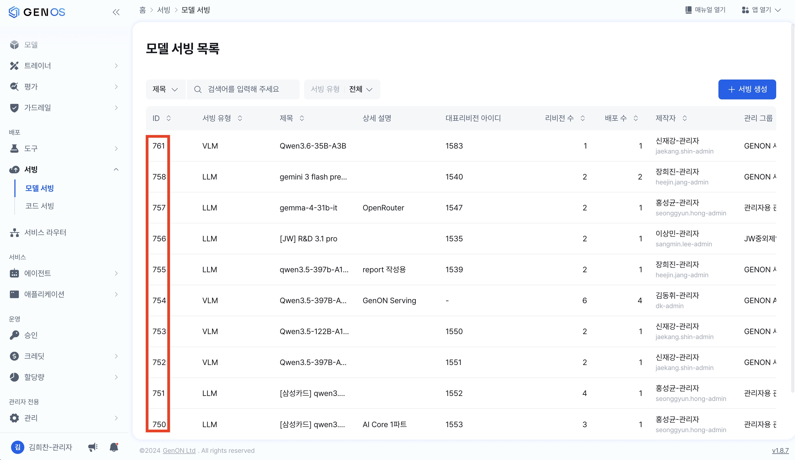
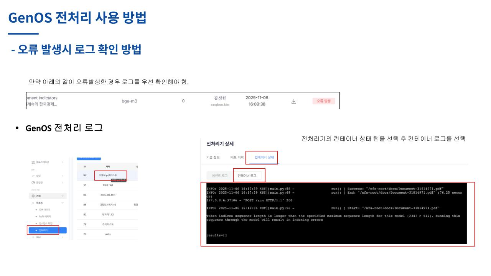

# Genos 코드서빙 전처리기 개발 매뉴얼

Genos 코드서빙으로 배포된 **문서 전처리기(doc parser)** 의 코드를 수정하고 재배포하는 방법을 다룹니다.
Genos 를 처음 접하는 외부 개발자를 대상으로 합니다.

## 목차

- [0. 이 문서에 대하여](#0-이-문서에-대하여) — 대상 독자 · **시작 상태** · 준비물 · 읽는 순서
- [1. Genos 기본 이해](#1-genos-기본-이해) — 모델 서빙 · 게이트웨이 · 리비전 · 코드스페이스
- [2. 코드서빙 기본 이해](#2-코드서빙-기본-이해) — 동작 모델 · 컨테이너 흐름 · 경로 제약
- [3. 전처리기 이해](#3-전처리기-이해) — 전처리기 5종 · 처리 흐름 · 저장소 2종 · 엔드포인트
- [4. 개발환경 준비](#4-개발환경-준비) — 로컬 · 코드스페이스 · 로컬에서 되는 것과 안 되는 것
- [5. 코드 이해](#5-코드-이해) — 코드 지도 · `main.py` 처리 순서 · parser 읽기 · chunker 읽기 · 출력 스키마
- [6. config yaml 옵션 설정](#6-config-yaml-옵션-설정) — 채워야 할 값 · 자주 바꾸는 옵션 · `params` 오버라이드
- [7. 코드 수정 가이드](#7-코드-수정-가이드) — 개발 루프 · 수정 레시피 · 알아둘 제약
- [8. 재배포](#8-재배포) — gitea push → 리비전 배포 → 호출 검증 → 로그
- [9. 퀵 가이드](#9-퀵-가이드) — 시나리오 A/B · 자주 쓰는 명령어
- 부록 [A 용어집](#부록-a-용어집) · [B 환경값 확인 목록](#부록-b-환경값-확인-목록) · [C 컨테이너 경로·환경변수](#부록-c-컨테이너-경로환경변수) · [D 참고 문서](#부록-d-참고-문서) · [E 코드서빙·코드스페이스 신규 생성](#부록-e-코드서빙코드스페이스-신규-생성)

---

## 0. 이 문서에 대하여

### 0.1 대상 독자

- **Python·Git 은 다룰 줄 알지만 Genos 는 처음인 개발자**를 가정합니다.
- 문서 파싱·RAG·docling 에 대한 사전 지식은 필요하지 않습니다. 필요한 개념은 그때그때 설명합니다.

> 모르는 단어가 나오면 **[부록 A 용어집](#부록-a-용어집)** 을 보세요.

### 0.2 시작 상태 — 이미 준비되어 있는 것

이 문서는 **아래가 모두 끝난 상태**에서 시작합니다. 여러분이 직접 만들 필요가 없습니다.

| 항목 | 상태 |
|---|---|
| Genos 플랫폼 | 설치·운영 중. 웹 UI 접속 가능 |
| LLM / VLM 모델 서빙 | Genos **모델 서빙**으로 등록되어 있음 |
| 코드서빙용 도커 이미지 | Genos **도커 이미지**로 등록되어 있음 (직접 빌드하지 않습니다) |
| 코드서빙(전처리기) | **이미 배포되어 동작 중.** 기본 동작하도록 초기 세팅 완료 |
| gitea 저장소 | 코드서빙 생성 시 함께 만들어져 있고, 동작하는 소스가 들어 있음 |

즉 여러분의 출발점은 **"이미 돌고 있는 전처리기를 내 요구에 맞게 고치는 것"** 입니다.

### 0.3 이 문서로 할 수 있는 것

1. **개발환경을 세팅**한다 — 로컬 또는 코드스페이스. (4장)
2. **코드를 이해**한다 — 무엇이 어디에 있고, 무엇을 고치면 무엇이 바뀌는지. (5장)
3. **config yaml 옵션을 조정**한다 — 코드를 안 고치고 동작을 바꾸는 방법. (6장)
4. **코드를 수정**한다 — 주로 파싱(`/parser`)과 청킹(`/chunker`). (7장)
5. **재배포하고 호출로 검증**한다. (8장)

### 0.4 이 문서가 다루지 않는 것

| 주제 | 참고 |
|---|---|
| 배포된 서빙을 **호출**하는 API 상세 (요청/응답 스키마, LLM 캐시 옵션) | [`code_serving.md`](code_serving.md) |
| 프로세서별 config 옵션 **전체 레퍼런스** | [`parser_processor.md`](parser_processor.md) · [`intelligent_processor.md`](intelligent_processor.md) · [`convert_processor.md`](convert_processor.md) · [`attachment_processor.md`](attachment_processor.md) |
| 개인정보 마스킹(가드레일) 구축 | [`guardrail_workflow_setup.md`](guardrail_workflow_setup.md) |
| 도커 이미지 빌드 | 여러분의 작업 범위가 아닙니다. 이미 등록된 이미지를 사용합니다 |
| Genos 플랫폼 자체의 설치·운영 | [Genos 공식 문서](https://genos-docs.gitbook.io/default) |

### 0.5 준비물 체크리스트

| 준비물 | 확인 방법 | 필요한 장 |
|---|---|---|
| Genos 웹 UI 계정 (ID/PW) | 웹 UI 로그인 | 8장 |
| Genos 웹 UI 주소 | 브라우저에서 열리는지 | 8장 |
| 내 코드서빙의 **gitea 저장소 id** | 코드서빙 상세 페이지 | 8장 |
| 내 코드서빙의 **serving_id** · **인증키** | 코드서빙 상세 페이지 | 8장 |
| 모델 서빙 ID (layout / LLM / OCR 주소) | 웹 UI 서빙 목록, 또는 이미 config 에 채워져 있음 | 6장 |
| Python 3.11 + [uv](https://docs.astral.sh/uv/) (로컬 개발 시) | `python3 --version` / `uv --version` | 4장 |

`<GENOS_HOST>` 처럼 **꺾쇠로 감싼 값**은 "환경마다 다름 — 직접 채워 넣으세요"를 뜻합니다.
무엇을 어디서 확인하는지는 [부록 B](#부록-b-환경값-확인-목록)에 정리했습니다.

### 0.6 읽는 순서

- **처음이라면** 1장 → 2장 → 3장 순서로 개념을 잡고 4장으로 가세요.
- **코드를 고치는 것이 목적이라면** 4장(환경) → 5장(코드 이해) → 7장(수정) → 8장(재배포).
- **설정만 바꾸면 되는 경우** [9.1 시나리오 A](#91-시나리오-a--config-만-바꿔-재배포)로 바로 가세요.
- **코드를 고치기 전에** [7.3 알아둘 제약](#73-알아둘-제약)을 먼저 읽으세요.

---

## 1. Genos 기본 이해

### 1.1 Genos 란

Genos 는 **LLM/RAG 애플리케이션 플랫폼**입니다. 모델을 올리고(서빙), 문서를 벡터 DB 에 적재하고,
챗봇·워크플로우를 만드는 작업을 웹 UI 에서 합니다.

우리가 다룰 **전처리기(preprocessor)** 는 그중 "문서 파일 → 검색 가능한 텍스트 조각(청크)" 변환을
담당하는 부품입니다.

공식 문서: <https://genos-docs.gitbook.io/default>

### 1.2 웹 UI 지도 (이 문서에 필요한 부분만)

```
Genos 웹 UI
├─ 서빙 ── 모델 서빙        ← 1.3 layout/LLM 모델의 serving_id 확인
│        └ 코드 서빙        ← 8장 여기서 리비전을 만들어 재배포
└─ 개발 ── 코드 스페이스    ← 4.2 브라우저 VSCode (gitea 저장소 작업용)
```

> 메뉴 이름·위치는 Genos 버전에 따라 다를 수 있습니다. 못 찾으면 공식 문서의
> [코드서빙](https://genos-docs.gitbook.io/default/basic-tutorials/guides/development/code_serving) /
> [코드스페이스](https://genos-docs.gitbook.io/default/basic-tutorials/guides/development/code_space)
> 페이지와 대조하세요.

### 1.3 모델 서빙과 `serving_id`

Genos 에서 **모델 서빙(model serving)** 은 LLM·OCR·레이아웃 분석 모델을 HTTP API 로 띄워 둔 것입니다.
각 서빙에는 숫자 ID(`serving_id`)가 붙고, 이 ID 로 호출 주소가 결정됩니다.

```
http://llmops-gateway-api-service:8080/rep/serving/<SERVING_ID>/v1/chat/completions
```

전처리기는 문서를 처리하면서 이 주소들을 호출합니다. ID 는 웹 UI **서빙 > 모델 서빙** 목록에서 확인합니다.



전처리기가 사용하는 모델은 세 종류입니다.

| 용도 | config 안의 이름 | 비고 |
|---|---|---|
| 문서 레이아웃 분석 | `<LAYOUT_SERVING_ID>` | vision 모델. GPU 필요 |
| Enrichment (목차·메타데이터·이미지/표 설명) | `<ENRICHMENT_SERVING_ID>`, `<IMAGE_DESCRIPTION_SERVING_ID>`, `<PAGE_DESCRIPTION_SERVING_ID>` | LLM. 이미지 설명은 vision 필요 |
| OCR | `<OCR_ENDPOINT>` | 서빙 ID 가 아니라 **주소**를 씁니다 |

> **이미 배포된 코드서빙은 이 값들이 채워져 있습니다.** 값을 바꿀 일이 없다면 6장을 건너뛰어도 됩니다.
> enrichment 계열 3개는 같은 서빙 하나로 겸할 수 있습니다(이미지·페이지 설명은 vision 지원 모델이어야 함).

### 1.4 게이트웨이와 인증키

배포된 코드서빙은 **게이트웨이**를 통해 호출합니다.

```
{base URL}/api/gateway/code_serving/{serving_id}/{route}
헤더: Authorization: Bearer {auth_key}
```

| 항목 | 어디서 얻나 |
|---|---|
| `base URL` | Genos 웹 UI 주소 (예: `https://<GENOS_HOST>`) |
| `serving_id` | **코드서빙** 상세 페이지 |
| `auth_key` | 코드서빙 상세 페이지의 인증키 항목 |

> 모델 서빙의 `serving_id`(1.3)와 코드서빙의 `serving_id`(1.4)는 **다른 값**입니다.
> 전자는 전처리기가 *호출하는* 대상, 후자는 전처리기 *자신*의 ID 입니다.

### 1.5 리비전(Revision)

Genos 의 서빙은 **리비전** 단위로 배포됩니다. 리비전 하나가
"도커 이미지 + 소스 커밋 + 인스턴스 사양 + 환경변수" 조합을 고정한 스냅샷입니다.

- 코드를 바꿨다 → **새 커밋을 가리키는 리비전을 만들어 배포**해야 반영됩니다.
- git push 만으로는 반영되지 않습니다.

### 1.6 코드스페이스(Code Space)

브라우저에서 열리는 **VSCode 개발 환경**입니다. Genos 내부에 있으므로 gitea 저장소에 바로 접근할 수
있습니다. 이 문서에서는 "소스를 gitea 저장소에 올리는 작업대"로 사용합니다(4.2절).

### 1.7 용어 대응표

| 일반 개발 용어 | Genos 용어 | 비고 |
|---|---|---|
| 컨테이너 이미지 저장소 | 도커 이미지 | 이미 등록되어 있음 |
| 배포/릴리스 | 리비전 생성 → 배포 | |
| API 게이트웨이 | 게이트웨이 | `/api/gateway/...` 경로 |
| API 키 | 인증키(auth key) | `Authorization: Bearer` |
| Git 서버 | gitea | 코드서빙 생성 시 저장소가 함께 만들어짐 |
| 클라우드 IDE | 코드 스페이스 | 브라우저 VSCode |
| 모델 엔드포인트 | 모델 서빙 + `serving_id` | |

---

## 2. 코드서빙 기본 이해

### 2.1 코드서빙이란

**코드서빙 = "내가 만든 FastAPI 앱을 Genos 위에서 돌리는 기능"** 입니다.

Genos 는 미리 만들어 둔 **도커 이미지**를 실행하고, 런타임에 **여러분의 git 저장소를 컨테이너 안으로
clone** 한 뒤 그 안의 `main.py` 를 실행합니다.

즉 **이미지에는 무거운 라이브러리만 들어 있고, 실제 코드는 git 에서 옵니다.** 그래서 코드를 고칠 때
**도커 이미지를 다시 빌드할 필요가 없습니다** — git push 하고 리비전만 다시 만들면 됩니다.

### 2.2 컨테이너 안에서 벌어지는 일

```
[컨테이너 부팅]
      │
      ▼
 supervisord                                  (프로세스 관리자. 죽으면 자동 재시작)
      │
      ▼
 scripts/entrypoint.sh
      │
      ├─ /app/.init_done.<COMMIT_HASH> 마커가 없으면 ──▶ scripts/init.sh
      │                                                    │
      │                                                    ├─ git clone <저장소>
      │                                                    │     → /app/src/service
      │                                                    ├─ git checkout <COMMIT_HASH>
      │                                                    └─ BUILD_COMMAND 가 있으면 그것을 실행
      │                                                       없으면 requirements.txt 가 있을 때
      │                                                         pip install -r requirements.txt \
      │                                                           --find-links packages/
      │      (init.sh 가 정상 종료하면 마커 생성 → 같은 커밋으로는 다시 실행하지 않음)
      ▼
 cd /app/src/service
      │
      └─ main.py 가 있으면 ──▶ uvicorn main:app --host 0.0.0.0 --port ${PORT:-8080}
```

> **위 `scripts/entrypoint.sh` · `scripts/init.sh` 는 도커 이미지 안에 있고, 여러분의 저장소에는
> 없습니다.** 찾지 마세요. 흐름을 이해하기 위한 설명입니다.
>
> 리비전 설정에서 `START_COMMAND`(시작 명령)나 `BUILD_COMMAND`(설치 명령)를 지정하면 위 기본 동작
> 대신 그것이 실행됩니다. 배포가 예상과 다르게 동작하면 리비전에 이 값들이 들어 있는지 확인하세요.

기억할 점 세 가지:

1. **소스가 놓이는 경로는 `/app/src/service`** 입니다. 문서 파일 경로를 지정할 때 이 경로가 기준이 됩니다.
   (예: `/app/src/service/genon/preprocessor/sample_files/pdf_sample.pdf`)
2. **`requirements.txt` 의 pip install 은 이미지의 가상환경(`/app/.venv`)에 그대로 들어갑니다.**
   별도 환경으로 갈라지지 않습니다.
3. **init 은 커밋 해시마다 한 번만** 돕니다. 같은 커밋으로 재시작하면 clone/pip 을 건너뜁니다.
   커밋이 바뀌면 자동으로 다시 실행됩니다.

> ⚠️ **pip install 이 실패해도 재시도되지 않습니다.** `init.sh` 는 pip 실패를 경고로만 남기고 정상
> 종료하므로 마커가 그대로 생성됩니다. 컨테이너를 재시작해도 같은 커밋인 한 다시 설치하지 않으니,
> 의존성 문제는 **새 커밋으로 리비전을 다시 만들어** 해결하세요.
> (`git clone` 실패는 실제로 실패 처리되어 다음 부팅에 재시도됩니다.)

### 2.3 호출 경로 제약 — 경로는 한 조각만

```
{base}/api/gateway/code_serving/{serving_id}/{route}
                                              └── 슬래시 없는 단일 세그먼트만 전달됨
```

게이트웨이는 `{route}` 를 **단일 세그먼트로만** 전달합니다. 그래서 `/preprocess/attachment` 같은 중첩
경로는 호출할 수 없고, 전처리기는 `/preprocess_attachment` 처럼 **평탄한 이름**을 씁니다.

> **새 엔드포인트를 추가할 때 반드시 지켜야 하는 규칙**입니다. [7.2 (c)](#c-새-엔드포인트-추가하기) 참고.

### 2.4 코드와 설정이 모두 git 저장소 안에 있다

코드서빙에서는 **파이썬 코드와 config yaml 이 모두 git 저장소의 파일**입니다.
웹 UI 에 코드를 붙여넣거나 설정 파일을 업로드하는 방식이 아닙니다.

| 무엇을 바꾸려면 | 어디를 고치나 |
|---|---|
| 처리 로직 | `genon/preprocessor/facade/*_processor.py` |
| 동작 옵션(모델 주소, 청크 크기 등) | `genon/preprocessor/resource/*.yaml` |
| 프롬프트 | `genon/preprocessor/resource/prompt_*.md` |

고친 뒤에는 **commit/push → 리비전 생성 → 배포** 가 항상 따라옵니다(8장).

---

## 3. 전처리기 이해

### 3.1 전처리기 5종

전처리기는 목적이 다른 5개 파일(facade)로 구성되고, 코드서빙은 **5개를 한꺼번에** 띄웁니다.

| facade 파일 | 용도 | 엔드포인트 |
|---|---|---|
| `parser_processor.py` | **파싱** — 문서를 구조화 결과로 변환 | `/parser`, `/parser_upload` |
| `chunking_processor.py` | **청킹** — 파싱 결과를 청크로 자름 | `/chunker` |
| `intelligent_processor.py` | 적재용(지능형) — 파싱+청킹 일괄 | `/preprocess`, `/preprocess_intelligent` |
| `convert_processor.py` | 변환용 — 모든 문서를 PDF 로 표준화 후 추출 | `/preprocess_convert` |
| `attachment_processor.py` | 첨부용 — 빠른 텍스트 추출 | `/preprocess_attachment` |

> **여러분이 주로 고칠 것은 위쪽 두 개(`parser_processor.py`, `chunking_processor.py`)** 입니다.
> 이 문서의 5장·7장도 그 두 파일을 중심으로 설명합니다.
> 각 전처리기의 특징 비교는 [`intro.md`](intro.md) 를 보세요(그 문서는 파싱/청킹을 분리하지 않는
> 4종 기준으로 쓰여 있어 `chunking_processor` 는 나오지 않습니다).

### 3.2 두 가지 처리 흐름

```
① 단일 단계 (/preprocess*)
   원본 문서 ──────────────────────────────▶ 청크 리스트
              파싱 + enrichment + 청킹을 한 번에

② 2단계 (/parser → /chunker)
   원본 문서 ──POST /parser──▶ 파싱 결과 JSON ──POST /chunker──▶ 청크 리스트
   (report.pdf)                 data.document (docling 포맷)
   (sheet.csv)                  data.elements (parse-format)
```

- 무거운 처리(OCR·레이아웃 분석·enrichment)는 **파싱 단계에서 끝납니다.** 그래서 청킹만 반복해서
  튜닝하는 것이 가능합니다 — 개발 중에 특히 유용합니다.
- 포맷에 따라 파싱 결과의 형태가 갈립니다.

  | 구분 | 확장자 |
  |---|---|
  | docling (`data.document`) | `pdf` `html` `htm` `docx` `hwp` `hwpx` `hml` `ppt` `pptx`, 그리고 `formats.xlsx.processing_mode: docling` 인 `xlsx`/`xlsm` |
  | parse-format (`data.elements`) | `csv` `txt` `md` `json` `doc` 이미지(`jpg`/`png` …) 오디오(`mp3`/`wav`/`m4a`), `tabular` 모드의 `xlsx`/`xlsm` |

  > `ppt`/`pptx` 는 PDF 로 변환한 뒤 docling 으로 파싱합니다. **변환에 실패하면 parse-format 으로
  > 폴백**되므로 같은 파일이 환경에 따라 다른 형태로 나올 수 있습니다.

- `/chunker` 는 둘 중 어느 쪽이 와도 자동으로 판별합니다.
- docling 포맷에서 `data.document` 를 받으려면 `parser_processor_config.yaml` 의
  **`output.format: "docling"`** 이어야 합니다(출고 기본값이 `docling`).

### 3.3 저장소 2종 — 어느 저장소를 만지는가

| # | 저장소 | 무엇인가 | 여러분이 할 일 |
|---|---|---|---|
| 1 | `github.com/genonai/doc_parser_code_serving` | **공개 배포본.** 전처리기 소스 + docling wheel | clone 해서 읽고, 최신 소스를 받아올 때 사용 |
| 2 | **내 gitea 저장소** | 코드서빙이 실제로 clone 하는 저장소. 동작하는 소스가 이미 들어 있음 | **여기를 수정하고 push** |

```
 doc_parser_code_serving (public, 참조용)
      │  최신 소스를 가져올 때만
      ▼
 내 gitea 저장소  ──런타임 clone──▶  /app/src/service  ──▶ uvicorn main:app
   ↑
   └── 코드/설정 수정은 여기서 (코드스페이스 또는 로컬)
```

- 공개 배포본은 **인증 없이 clone** 할 수 있습니다.
- docling 은 소스 대신 `packages/*.whl`(wheel)로 동봉됩니다. **docling 자체는 수정할 수 없습니다** —
  바꾸고 싶은 동작은 facade 코드에서 처리하세요.

### 3.4 소스 트리

```
저장소 루트 (= 컨테이너의 /app/src/service)
├── main.py                             ★ 진입점 (FastAPI 앱) — 코드서빙이 실행하는 파일
├── requirements.txt                    런타임 pip install 대상 (docling wheel 한 줄)
├── requirements-dev.txt                로컬 개발 전용 deps
├── packages/*.whl                      docling wheel (수정 불가)
├── VERSION                             이 소스가 어느 릴리스에서 나왔는지
├── README.md                           배포본 사용 가이드
└── genon/preprocessor/
    ├── facade/
    │   ├── parser_processor.py         ★ 파싱  (주 수정 대상)
    │   ├── chunking_processor.py       ★ 청킹  (주 수정 대상)
    │   ├── intelligent_processor.py
    │   ├── convert_processor.py
    │   ├── attachment_processor.py
    │   ├── enrichment/                 목차·메타데이터·이미지/표 설명 등 공용 모듈
    │   ├── guardrail/                  개인정보 탐지·마스킹
    │   └── gitbook_doc/                이 문서를 포함한 매뉴얼
    ├── resource/                       ★ config yaml + 프롬프트 md  (설정 수정 대상)
    ├── converters/                     HWP→PDF, xlsx 처리
    ├── examples/                       테스트 스크립트
    ├── sample_files/                   샘플 문서
    ├── src/                            로거·응답 유틸·설정 등 런타임 공통 코드
    │                                    (여기의 src/main.py 는 다른 배포 방식용 — 수정 대상 아님)
    └── tests/                          단위·회귀 테스트
```

**중요:** facade 인스턴스는 **모듈 로드 시점에 1회만 생성**되어 재사용됩니다.
그 결과 **config yaml 을 바꾸면 재배포(컨테이너 재기동)해야 반영**됩니다.
재배포 없이 값을 바꿔 보려면 요청 `params` 로 넘기세요([6.5절](#65-yaml-을-안-고치고-값만-바꿔-보기--요청-params)).

### 3.5 엔드포인트

| 메서드 | 경로 | 담당 facade | 비고 |
|---|---|---|---|
| `GET` | `/health` | — | `{"status":"ok"}` |
| `POST` | `/parser` | parser | `IS_PARSER` 마커 필요 |
| `POST` | `/parser_upload` | parser | 파일 업로드(multipart) 변형 |
| `POST` | `/chunker` | chunking | `IS_CHUNKER` 마커 필요 |
| `POST` | `/preprocess` | intelligent | 하위호환 별칭 |
| `POST` | `/preprocess_intelligent` | intelligent | |
| `POST` | `/preprocess_convert` | convert | |
| `POST` | `/preprocess_attachment` | attachment | |

**공통 요청/응답 형태**

```json
// 요청
{ "file_path": "/app/src/service/.../report.pdf", "params": { } }
```
```json
// 응답 — HTTP 상태는 성공/실패 모두 200
{ "code": 0, "errMsg": "success", "data": { } }
```

> **성공 여부는 HTTP 상태 코드가 아니라 `code` 값으로 판단하세요.** 실패해도 HTTP 200 이고
> `code` 가 0 이 아닙니다.

요청/응답 스키마 상세는 [`code_serving.md`](code_serving.md) 를 참고하세요.

---

## 4. 개발환경 준비

코드를 고칠 때마다 배포해서 확인하면 너무 느립니다. **로컬에서 파싱·청킹을 직접 돌려 보는 환경**을
먼저 만들어 두세요.

> 아래 4.1~4.5 절차는 공개 배포본을 그대로 받아 **실제로 실행해 확인한 것**입니다
> (Python 3.11 + macOS/CPU 기준). 다른 OS·파이썬 버전에서는 세부가 다를 수 있습니다.

### 4.1 로컬 개발환경 (권장)

**필요한 것**: Python 3.11, [uv](https://docs.astral.sh/uv/), 인터넷 연결(최초 1회 모델 다운로드)

```bash
# 실행 위치: 내 PC 의 작업 폴더
# ① 공개 배포본 clone — 인증 불필요
git clone https://github.com/genonai/doc_parser_code_serving.git
cd doc_parser_code_serving

# ② 가상환경 + 의존성 설치
uv venv --python 3.11
source .venv/bin/activate                 # Windows: .venv\Scripts\activate
uv pip install -r requirements.txt        # 동봉된 docling wheel
uv pip install -r requirements-dev.txt    # 로컬 실행용 deps

# ③ parser / chunker 를 다루려면 아래도 필요합니다
#    (requirements-dev.txt 에 이미 들어 있으면 그냥 넘어갑니다)
uv pip install pymupdf langchain-community langchain-core langchain-text-splitters \
               markdown2 pydub chardet
```

> ⚠️ **`uv sync` 를 쓰지 마세요.** 동봉된 `genon/preprocessor/pyproject.toml` 의 docling 의존성이
> 소스가 없는 저장소 루트를 가리켜 실패합니다. 위처럼 `uv pip install -r ...` 로 설치하세요.
>
> ③이 왜 필요한가: `parser_processor.py` 가 모듈 최상위에서 `fitz`(pymupdf)·`langchain_*`·`markdown2`·
> `pydub` 를 import 하고, `attachment_processor.py` 는 `langchain_text_splitters`·`chardet` 을 씁니다.
> 이들이 없으면 **파일을 열어 보기 전에 import 부터 실패**합니다.
> (`intelligent_processor.py` 만 쓸 때는 ②까지로 충분합니다.)

**설치 확인** — 5개 facade 가 모두 import 되면 성공입니다.

```bash
python -c "
import sys; sys.path.insert(0,'.')
for m in ('parser','chunking','intelligent','attachment','convert'):
    __import__(f'genon.preprocessor.facade.{m}_processor'); print('OK', m)
"
```

> `ModuleNotFoundError: No module named 'fitz'` 등이 나면 위 ③을 건너뛴 것입니다.

> `HWP SDK 경로를 찾을 수 없습니다` · `WeasyPrint could not be imported` ·
> `fitz API is deprecated` 경고는 **정상**입니다. 로컬에 해당 바이너리가 없어서 나는 것이고
> 파싱·청킹 자체에는 영향이 없습니다(4.3절).

> **로컬 산출물이 git 변경으로 잡힙니다.** 저장소 루트에 `.gitignore` 가 없어 `.venv/` 와
> `__pycache__/` 가 미추적 파일로 보입니다(테스트 결과 폴더는 이미 무시됩니다).
> **gitea 로 push 하지 마세요.**

### 4.2 코드스페이스 개발환경

gitea 저장소에 접근하려면 Genos 내부망에서 git 을 실행해야 합니다. 그 작업대가 코드스페이스입니다.

1. 웹 UI **개발 > 코드 스페이스**에서 코드스페이스를 생성합니다.
2. **VSCode** 버튼을 눌러 브라우저 IDE 를 엽니다.
3. 터미널(`Terminal > New Terminal`)에서 gitea 저장소를 clone 합니다(8.3절).

> 코드스페이스는 **코드 수정과 push 용도**로 쓰세요. 파이썬 실행 환경은 코드스페이스 이미지에 따라
> 다르므로, 동작 검증은 **로컬(4.1)** 또는 **재배포 후 호출**(8.7)로 하는 것이 확실합니다.
>
> 볼륨 용량이 부족하면 clone 이 실패합니다. 소스는 수백 MB 수준이므로 **최소 5GB** 이상 잡으세요.
> 참고: [코드스페이스 볼륨 쿼터](https://genos-docs.gitbook.io/default/basic-tutorials/guides/development/code_space/create_volume_quota)

### 4.3 로컬에서 되는 것 / 안 되는 것

| | 로컬 | 비고 |
|---|---|---|
| 청킹만 테스트 (파싱 결과 JSON 입력) | ✅ | **모델 서빙 없이 즉시 가능.** 청킹 로직 수정에 가장 유용 |
| 파싱 (PDF/DOCX/HTML) | ✅ | `layout_model_type: docling_layout` 로 바꿔야 합니다(4.4절). 최초 1회 모델 다운로드 필요 |
| 파싱 → 청킹 E2E | ✅ | 위 두 개를 이어서 |
| 배포된 서빙 호출 테스트 | ✅ | `examples/code_serving/serving_gateway_test.py` (8.7절) |
| 레이아웃 분석 VLM · OCR · enrichment LLM | ❌ | Genos 모델 서빙 주소가 필요. 로컬에서는 끄고 씁니다(4.4절) |
| HWP/HWPX 파싱 | △ | 전용 바이너리가 로컬에 없어 LibreOffice 폴백만 동작(품질 낮음). LibreOffice 도 없으면 실패 |
| 음성(Whisper) 처리 | ❌ | 음성인식 서버 주소 필요 |
| `python main.py` 로 API 서버 띄우기 | ❌ | uvicorn 등 추가 의존성과 런타임 환경변수(로그·메시지큐 설정)가 필요합니다. **엔드포인트 검증은 재배포 후 게이트웨이 호출로 하세요**(8.7절) |
| `pytest` 전체 실행 | △ | 일부 테스트가 배포본에 없는 개발용 설정 폴더를 참조해 실패합니다. 특정 파일만 골라 실행하세요 |

### 4.4 로컬 검증용 config 조정

로컬에서는 외부 모델 서빙에 닿지 않으므로, 파싱을 돌려 보려면 `genon/preprocessor/resource/` 의
config 를 아래처럼 바꿉니다.

| 파일 | 키 | 로컬 값 |
|---|---|---|
| `parser_processor_config.yaml` | `layout.layout_model_type` | `docling_layout` |
| | `ocr.ocr_mode` | `disable` |
| | `enrichment` 각 항목의 `enable` | `false` |
| | `formats.ppt.page_description.enable` | `false` |

> `docling_layout` 은 GPU 가 없어도 CPU 로 동작합니다(느립니다). 최초 1회 레이아웃/표 모델을
> HuggingFace 에서 내려받으므로 네트워크가 필요하고, 이후에는 캐시를 씁니다.
>
> ⚠️ **이렇게 고친 config 는 gitea 로 push 하지 마세요.** 운영에서는 모델 서빙을 써야 합니다.

**실측 참고** — 위 설정으로 동봉 샘플(`pdf_sample.pdf`, 11페이지) 파싱에 약 20초, 이어서 청킹 25개
생성까지 수 초가 걸렸습니다(Apple Silicon, CPU/MPS 기준). 최초 실행은 모델 다운로드로 더 걸립니다.

### 4.5 로컬에서 파싱·청킹 돌려 보기

**① 먼저 파싱 → 청킹 E2E 를 한 번 돌립니다** (4.4 config 조정이 되어 있어야 합니다)

```bash
# 실행 위치: genon/preprocessor/examples/parse_chunk
python parse_chunk_test.py ../../sample_files/pdf_sample.pdf result_parse_chunk/
```

결과 폴더에 파싱 결과 JSON(`result_parse_chunk/<문서명>.docling.json`)과 청크 결과가 생깁니다.

**② 이후에는 그 파싱 결과로 청킹만 반복** — 모델이 필요 없어 몇 초면 끝납니다.
청킹 로직을 고칠 때 이 루프를 쓰세요.

```bash
# 실행 위치: genon/preprocessor/examples/parse_chunk
python parse_chunk_test.py result_parse_chunk/pdf_sample.docling.json result_parse_chunk/
```

`parse_chunk_test.sh` 에 다른 시나리오들이 주석으로 정리되어 있습니다(`--doc_type`, `--error_policy`,
LLM 캐시 등). 다만 그 주석의 일부 경로는 작성자 로컬 기준이라 그대로 동작하지 않습니다 — 명령 형태만
참고하세요. 청크 크기는 `--chunk-size` 로 조절합니다(기본 10000).

**직접 호출해 보기** — 코드를 고치면서 결과를 바로 확인할 때 편합니다.

```python
# 실행 위치: 저장소 루트
import asyncio, json, sys
sys.path.insert(0, '.')
from fastapi import Request
from genon.preprocessor.facade.chunking_processor import DocumentProcessor

p = DocumentProcessor(config_path='genon/preprocessor/resource/chunking_processor_config.yaml')
doc = json.load(open('doc.json'))          # 파싱 결과 JSON
chunks = asyncio.run(p(Request(scope={'type': 'http'}), '', document=doc))
print(len(chunks), chunks[0].model_dump()['text'][:80])
```

---

## 5. 코드 이해

코드를 고치기 전에 **무엇이 어디에 있는지** 파악하는 장입니다.
`parser_processor.py`(2,700줄)와 `chunking_processor.py`(2,900줄)는 길지만, **실제로 봐야 하는 곳은
몇 군데뿐**입니다. 나머지는 다른 facade 에서 복사해 온, 해당 엔드포인트에서는 호출되지 않는 코드입니다.

> **줄번호 표기에 대하여** — 이 장의 줄번호는 작성 시점 소스 기준이며 릴리스마다 조금씩 밀립니다.
> **함수·클래스 이름으로 찾는 것을 기본으로** 하고 줄번호는 위치 감각용으로만 쓰세요.
> ```bash
> grep -n "def _build_docling_response" genon/preprocessor/facade/parser_processor.py
> ```

### 5.1 코드 지도

| 위치 | 역할 | 수정 대상인가 |
|---|---|---|
| `main.py` | FastAPI 앱. 라우트 정의 + 공통 예외/응답 처리 | 엔드포인트를 추가할 때만 |
| `facade/parser_processor.py` | `/parser` 구현 | **예** |
| `facade/chunking_processor.py` | `/chunker` 구현 | **예** |
| `facade/intelligent_processor.py` · `convert_processor.py` · `attachment_processor.py` | `/preprocess*` 구현 | 해당 엔드포인트를 쓸 때만 |
| `facade/enrichment/` | 목차·메타데이터·이미지/표 설명 등 공용 모듈 | enrichment 동작을 바꿀 때 |
| `facade/guardrail/` | 개인정보 탐지·마스킹 | 가드레일을 쓸 때 |
| `resource/*.yaml`, `resource/prompt_*.md` | 설정·프롬프트 | **예** (6장) |
| `src/` | 로거, 응답 유틸, 설정 로딩 | 거의 없음 |
| `converters/` | HWP→PDF, xlsx 처리 | 해당 포맷을 다룰 때 |
| `packages/*.whl` | docling 엔진 | **불가** — facade 에서 우회 |

### 5.2 `main.py` — 요청이 처리되는 순서

```
POST /parser
   │
   ├─ 라우트 함수: file_path, params 를 받는다
   ▼
_run(tag, processor, request, file_path, params, marker='IS_PARSER')
   │
   ├─ ① 마커 확인 — processor 에 IS_PARSER 가 없으면 "지원하지 않습니다" 응답
   ├─ ② 시작 로그
   ├─ ③ params.request_deadline 이 있으면 asyncio.wait_for 로 상한
   ├─ ④ await processor(request, file_path, **params)      ← facade 진입
   ├─ ⑤ 성공 → {"code":0, "errMsg":"success", "data": <facade 반환값>}
   ├─ ⑥ 예외 → {"code":1, "errMsg", "error_code", "error_type", "tag", "file_path", "traceback"}
   └─ ⑦ 소요시간 로그
```

- **응답 봉투(envelope)는 `main.py` 소유**입니다. facade 는 `data` 에 들어갈 값만 반환하면 됩니다.
  facade 에서 `code`/`data` 같은 키를 만들면 이중으로 감싸집니다.
- 성공·실패 모두 **HTTP 200**. 실패는 `code` 로 알립니다.
- facade 가 `GenosServiceException` 으로 던진 오류는 `error_code` 가 보존됩니다. 그 외 예외는
  타입에 따라 `INPUT_ERROR`/`TIMEOUT_ERROR`/`INTERNAL_ERROR` 로 자동 분류됩니다.

### 5.3 `DocumentProcessor` 계약

`main.py` 는 각 facade 에 대해 아래를 가정합니다. 이 계약을 깨면 해당 엔드포인트가 동작하지 않습니다.

```python
class DocumentProcessor:          # ← 클래스 이름 고정. main.py 가 이 이름으로 import
    IS_PARSER: bool = True        # /parser 를 지원하는 facade 만
    IS_CHUNKER: bool = True       # /chunker 를 지원하는 facade 만

    def __init__(self, config_path: str | None = None):
        ...

    async def __call__(self, request: Request, file_path: str, **kwargs) -> dict:
        ...
```

| 항목 | 지켜야 할 것 |
|---|---|
| 클래스 이름 | `DocumentProcessor` 고정 |
| 마커 | `IS_PARSER` / `IS_CHUNKER`. 없으면 요청이 facade 에 도달하지 못하고 거부됩니다 |
| `__call__` | **async** 여야 하고, 요청의 `params` 가 `**kwargs` 로 들어옵니다 |
| 반환값 | 그대로 응답의 `data` 가 됩니다 (parser=dict, chunker=청크 리스트) |
| 생성 시점 | 모듈 로드 시 **1회** 생성되어 프로세스 전역에서 재사용됩니다 |

> 전역 1회 생성이라는 점이 중요합니다. `self` 에 요청별 상태를 담으면 **동시 요청 간에 섞일 수**
> 있습니다. 요청별 값은 `kwargs` 로 받아 지역 변수로 다루세요.

### 5.4 `parser_processor.py` 읽기

#### 파일 구획

| 줄 | 구획 | 봐야 하나 |
|---|---|---|
| 1–150 | import (docling 백엔드, langchain 로더, enrichment 모듈) | 참고 |
| 169–191 | `_handle_stage_error` — enrichment 단계 실패 정책(`strict`/`lenient`) | 참고 |
| 193–336 | **입력 파일 사전 검증** — 매직헤더·암호화·DRM 감지 | 포맷을 늘릴 때 |
| 340–486 | 설정 로딩 헬퍼 (`_load_config`, `_parse_optional_*` 등) | 옵션 추가 시 |
| 488–597 | PDF 변환 헬퍼 (`convert_to_pdf` 등) | 참고 |
| 603–1826 | 로더들 (`TextLoader`, `AudioLoader`, `HwpDocumentLoader`, `DocxDocumentLoader`, `GenericDocumentLoader`) | 포맷별 수정 시 |
| **827–1658** | **`IntelligentDocumentProcessor`(경량 사본)** — docling 파이프라인과 enrichment 실체 | OCR/layout/enrichment 수정 시 |
| 1833–1846 | `GenosServiceException` | 예외 처리 시 |
| **1853–2704** | **`DocumentProcessor`** — `/parser` 진입점 | **여기부터 읽으세요** |

#### `__init__` (1863–1938) 이 하는 일

1. config yaml 로드 → 2. **`IntelligentDocumentProcessor` 생성**(파싱·enrichment 전부 위임) →
3. 확장자별 로더 생성 → 4. whisper·output·guardrail·PPT 페이지설명 설정 정규화

주요 `self` 속성:

| 속성 | 의미 |
|---|---|
| `self._intel` | 실제 파싱/enrichment 엔진 |
| `self._hwp` / `self._docx` / `self._generic` | 확장자별 로더 |
| `self._output_format` | `json` / `html` / `markdown` / `docling` |
| `self._table_format` · `self._compact_tables` | 표 출력 형식 |
| `self._xlsx_cfg` | 엑셀 처리 모드 |
| `self._gr_cfg` | 개인정보 분류 설정 |
| `self._page_desc_options` | PPT 페이지 설명 옵션 |

#### `__call__` (2593–2704) — 확장자 라우팅

```
로깅 설정 → 런타임 kwargs 정규화 → 캐시 컨텍스트 설정 → 확장자 추출
   → 입력 파일 검증(_detect_unsupported_file)  ← 암호화/DRM/손상이면 즉시 에러
   → 확장자별 분기 (아래 표)
```

| 확장자 | 줄 | 파싱 메서드 | 파싱 결과 | 최종 조립 |
|---|---|---|---|---|
| `.wav .mp3 .m4a` | 2619 | `_parse_audio` | 문자열(전사 텍스트) | `_audio_to_parse_format` |
| `.csv .xlsx .xlsm` | 2624–2654 | 3분기: custom_fields 매칭 / `docling` 모드 / `tabular` 모드 | dict 또는 DoclingDocument | 각각 다름 |
| `.hwp .hwpx .hml` | 2657 | `_parse_hwp_hwpx` | DoclingDocument | `_build_docling_response` |
| `.docx` | 2665 | `_parse_docx` | DoclingDocument | `_build_docling_response` |
| `.pdf .html .htm` | 2673 | `_parse_docling` | DoclingDocument | `_build_docling_response` |
| `.ppt .pptx` | 2683 | `_parse_ppt_docling` | DoclingDocument 또는 None | 실패 시 parse-format 폴백 |
| 그 외 | 2700 | `_parse_other` | langchain Document 리스트 | `_langchain_to_parse_format` |

**docling 계열 4단 패턴** — 세 경로(hwp/docx/pdf)가 모두 동일합니다. 새 포맷을 추가할 때 그대로 따르세요.

```python
doc = self._parse_XXX(file_path, **kwargs)
doc = await self._apply_docling_post_enrichment(doc, _enrichment_context=ctx, **kwargs)
result = self._build_docling_response(doc, **kwargs)
if ctx.get("metadata"):
    result["metadata"] = ctx["metadata"]
return self._normalize_response(result)
```

#### 응답 조립

| 함수 | 줄 | 만드는 것 |
|---|---|---|
| `_docling_to_parse_format` | 2281 | **element 배열 생성기.** 문서를 순회해 `{category, content, coordinates, id, page}` 5키 dict 리스트 + `usage.pages` |
| `_build_docling_response` | 2455 | **`output.format` 분기 지점.** `docling`→`{"document": …}`(무손실 JSON), `json`→element 배열, `html`/`markdown`→문자열 |
| `_normalize_response` | 2439 | `content`/`elements`/`usage` 키 존재 보장. **모든 반환 경로가 통과** |
| `_tabular_to_parse_format` | 2533 | 시트 1개 = element 1개 (`category="table"`) |
| `_langchain_to_parse_format` | 2551 | Document 1개 = element 1개 (`category="paragraph"`) |
| `_audio_to_parse_format` | 2498 | element 1개 |

#### enrichment 연결

`_apply_docling_post_enrichment` (2139) 가 아래 순서로 호출합니다. 각 단계는 실패해도
`_handle_stage_error` 정책에 따라 계속 진행할 수 있습니다.

```
① doc_summary → ② image_description → ③ table_description → ④ metadata → ⑤ custom_fields → ⑥ doc_type 스탬프
```

> **목차(TOC)와 docling 내장 metadata 는 이 훅이 아닙니다.** `_parse_docling` 내부(2004)에서
> docling 파이프라인의 일부로 처리됩니다. TOC 동작을 바꾸려면 그쪽을 보세요.

#### 여기를 고치면 무엇이 바뀌나

| 목표 | 고칠 곳 | 주의점 |
|---|---|---|
| element 카테고리·필드 변경 | `_docling_to_parse_format` (2281–2369) | 5키 스키마는 `/chunker` 가 의존. **추가는 안전, 삭제·개명은 위험** |
| 표 출력 형식 | `_export_table_content` (2227) + 2325–2341 | `[표 설명]` 구분자·시트명 접두를 바꾸면 다운스트림 파싱에 영향 |
| 이미지 element 의 내용 | 2352–2358 | 현재 이미지 설명으로 `content` 를 덮어씀. 별도 필드로 빼려면 소비 측도 함께 확인 |
| 확장자 추가·라우팅 변경 | `__call__` (2619–2701) | 반드시 `_normalize_response()` 를 통과시켜 반환. docling 경로면 4단 패턴 복제 |
| OCR / layout 옵션 | `IntelligentDocumentProcessor` (979–1013, 1169–1250) | 파이프라인 옵션은 요청마다 재구성되는 부분이 있어 상태 추가 주의 |
| enrichment 단계 추가 | `_apply_docling_post_enrichment` (2139) | `try/except → _handle_stage_error(exc, "<stage>")` 패턴 유지 |
| 입력 검증 완화(새 포맷 허용) | `_detect_unsupported_file` (284) + 매직헤더 목록 (193) | 손상 파일을 통과시키면 뒤 단계에서 이상한 결과가 나옴 |
| `output.format` 값 추가 | `_normalize_output_format` (1940) + `_build_docling_response` (2463–2481) | **한쪽만 고치면 에러 없이 `json` 으로 폴백**됩니다 |

### 5.5 `chunking_processor.py` 읽기

#### 봐야 하는 곳은 네 군데

| 줄 | 구획 | 설명 |
|---|---|---|
| **342–1376** | **`GenosSmartChunker`** | 청킹 엔진 본체 |
| **2066–2090** | `split_documents` | 청커를 만들어 실행하는 지점 |
| **2131–2249** | `compose_vectors` | 청크 → 출력 스키마 조립 |
| **2552–2899** | parse-format 청킹 + `__call__` | 비-docling 경로와 진입점 |

> 나머지(`__init__` 의 OCR·PDF 파이프라인 설정, 1922–2062, 2380–2517)는 파서에서 복사해 온 코드로
> **`/chunker` 실행 시 호출되지 않습니다.** 여기를 고쳐도 청킹 동작은 바뀌지 않습니다.

#### `__call__` (2785) — 입력 판별과 분기

```
로깅 설정 → 캐시 컨텍스트 → 캐시/정책 키를 kwargs 에서 제거
   │
   ├─ 입력 채널 ① params["document"] (인라인)             ← 우선
   ├─ 입력 채널 ② file_path 가 .json 파일이면 그 파일을 로드  ← 폴백
   │    둘 다 없으면 에러
   │
   ├─ payload 형태 판별 (_classify_payload)
   │    {"document": …} 또는 docling dict → docling 경로
   │    {"elements": [...]}               → parse-format 경로
   │
   ├─ docling 경로:  split_documents → compose_vectors
   └─ parse-format:  _chunk_parse_format
```

> `_classify_payload`(1542)는 **`document` 를 `elements` 보다 먼저 검사**합니다. 파서 응답이 빈
> `"elements": []` 를 함께 담기 때문입니다. 이 순서를 바꾸면 docling 문서가 문자 기반 splitter 로
> 흘러가 청킹 품질이 크게 떨어집니다.

#### `GenosSmartChunker` — 필드와 파이프라인

| 필드 | 기본값 | 의미 |
|---|---|---|
| `max_tokens` | `1024` | 청크 상한. **`0` = 분할하지 않음** |
| `chunk_mode` | `split_only` | `split_only`=섹션 구조 보존 / `resize_all`=크기 기준 재조립 |
| `tokenizer_type` | `char` | `char`=문자 수 / `huggingface`=토큰 수 |
| `merge_peers` | `True` | **코드에서 읽지 않는 잔재 필드.** 바꿔도 동작이 변하지 않습니다 |

`chunk()` → `preprocess()`(382, 문서 순회·수집) → `_split_document_by_tokens()`(877, 실제 파이프라인)

```
표 단위 조기 반환 (1065–1102)   ← params 의 table_as_chunk 또는 xlsx 유래 문서
   표마다 독립 청크로 만들고 즉시 반환 (아래 단계 전부 우회)
      │ (해당 없으면)
      ▼
1단계   (1104)  섹션 헤더 기준 분할
2단계   (1135)  각 섹션 텍스트에 heading 붙이기
2.5단계 (1151)  긴 섹션 균등 분할              ← resize_all 전용
3단계   (1201)  단독 타이틀을 다음 섹션에 병합
4단계   (1228)  섹션들을 그룹으로 묶기
5단계   (1290)  인접 그룹 greedy 병합           ← resize_all 전용
5.5단계 (1320)  chunk_size 초과 그룹만 분할     ← split_only 전용
6단계   (1349)  최종 청크 객체 생성
```

**`chunk_mode` 가 갈리는 지점**

| 줄 | 효과 |
|---|---|
| 1155 | 2.5단계를 `resize_all` 만 실행 |
| **1260** | **`split_only` 핵심** — 4단계에서 아무 병합도 하지 않음 (섹션 1개 = 그룹 1개) |
| 1263 | `resize_all` 은 토큰 초과 시에만 새 그룹 |
| 1301 | 5단계 greedy 병합은 `resize_all` 전용 |
| 1323 | 5.5단계 초과분 분할은 `split_only` 전용 |

> **동작 요약**: `split_only` = 파서가 인식한 섹션 경계(예: 조항 단위)를 그대로 유지하고 큰 섹션만
> 쪼갬 → 작은 청크가 많이 나옵니다. `resize_all` = 전부 `chunk_size` 에 맞춰 재조립 → 균일한 크기.

**섹션 인식은 정규식이 아닙니다.** `_is_section_header`(827)가 docling 이 붙인 라벨
(`SECTION_HEADER`/`TITLE`)로 판정합니다. "제N조" 같은 텍스트 패턴으로 자르고 싶다면
이 함수에 정규식을 추가하고, **`preprocess`(427–430)의 같은 판정 코드와 `_get_section_header_level`(833)
까지 세 곳을 함께** 고쳐야 합니다.

#### 두 경로의 차이

| | docling 경로 | parse-format 경로 |
|---|---|---|
| 청커 | `GenosSmartChunker` (구조 인식) | 문자 기반 splitter |
| 크기 단위 | `char` / `huggingface` 선택 | **항상 문자 수** |
| overlap | 없음 | `chunking.recursive.chunk_overlap` (기본 100) |
| 좌표·미디어 | 실제 값 | `"."` 고정값 |
| 문서 metadata | 부착됨 | 없음 (단, 행 단위 custom_fields 는 예외) |

`_chunk_parse_format`(2751)은 4가지로 다시 갈립니다 — 행 단위 custom_fields / `[AUDIO]` 단일 청크 /
전부 표이면 `[DA]` 단일 청크 / 그 외 문자 분할.

#### 토크나이저

| `tokenizer_type` | 동작 |
|---|---|
| `char` (기본) | HF 토크나이저를 **로드하지 않고** `len(text)` 로 계산 |
| `huggingface` | HF 토크나이저로 토큰 수 계산. 로컬 경로가 없으면 HF ID 로 폴백 |

> **모드를 바꾸면 `chunk_size` 의 단위가 바뀝니다.** `chunk_size: 10000` 은 `char` 에서 1만 자,
> `huggingface` 에서 1만 토큰(대략 2~3만 자)입니다. 청크 크기가 급변하니 함께 조정하세요.

#### 여기를 고치면 무엇이 바뀌나

| 목표 | 고칠 곳 | 주의점 |
|---|---|---|
| 섹션 인식 규칙 변경 | `_is_section_header` (827) + `preprocess` (427–430) + `_get_section_header_level` (833) | **세 곳이 같은 판정을 중복 구현.** 하나만 고치면 헤더 스택과 레벨 계산이 어긋남 |
| 표를 항상 별도 청크로 | 1070 조건 | **코드 수정 없이** 요청 `params` 의 `table_as_chunk` 로 켤 수 있습니다. 켜면 1~6단계가 전부 우회됩니다 |
| 청크 메타데이터 필드 추가 | 가장 안전: `set_global_metadata` 경유 (스키마는 `extra` 허용) | 정식 필드로 올리려면 스키마·빌더·조립부 3곳 + parse-format 경로 3곳을 함께 |
| 병합 기준 변경 | 4단계 조건 (1258–1268), 5단계 (1290–1318) | 1260 을 완화하면 조 단위가 장 단위로 뭉쳐집니다 |
| 분할 기준 변경 | `split_items_evenly_by_tokens` (930–978) | 반환 구간은 **폭이 0 이 아니어야** 합니다. 0 이면 그 청크가 에러 없이 사라집니다 |
| parse-format 청킹 방식 | `_chunk_text_elements` (2583), 라우팅은 `_chunk_parse_format` (2751) | `chunk_size: 0`(미분할) 계약과 `[AUDIO]`/`[DA]` 하위호환 가드를 유지 |
| 표 직렬화 형식 | `_extract_table_text` (624), 큰 표는 `_table_item_to_texts` (726) | 요청 `params` 의 `export_to_html: 0` 으로도 markdown 전환 가능(코드 수정 불필요). 다만 큰 표 분할 경로는 HTML 전제 |
| `HEADER:` 접두 형식 | `compose_vectors` (2211) + `_generate_section_text_with_heading` (844) | 헤더 문자열이 **두 군데서 두 번** 붙습니다. 한쪽만 고치면 중복 또는 누락 |

### 5.6 enrichment 모듈

`facade/enrichment/` 의 모듈이 config 의 `enrichment` 항목과 대응됩니다.

| 모듈 | config 항목 | 프롬프트 파일 |
|---|---|---|
| `doc_summary.py` | `doc_summary` | `prompt_doc_summary.md` |
| `image_description.py` (+`chart_detection.py`) | `image_description` | `prompt_image_description_default.md`, `prompt_chart_description_default.md` |
| `table_description.py` | `table_description` | `prompt_table_description_default.md`, `prompt_table_refine_combined.md` |
| `metadata_enricher.py` | `metadata` | `prompt_metadata_default_{system,user}.md` |
| `custom_fields_enricher.py`, `tabular_custom_fields.py` | `custom_fields` | `prompt_custom_fields_card_{system,user}.md` + `custom_field_*.yaml` |
| `page_description.py` | `formats.ppt.page_description` | `prompt_page_image_description_{default,fast}.md` |
| `enrichment_config.py` | `enrichment` 전체 파싱 | — |
| (docling 내장) | `toc` | `prompt_toc_default_{system,user}.md` |

### 5.7 출력 스키마 (청크)

청크 하나가 아래 필드를 가집니다. 스키마는 **추가 필드를 허용**하도록 되어 있습니다.

| 필드 | 의미 |
|---|---|
| `text` | 청크 본문. 앞에 `HEADER: <섹션 제목들>` 줄이 붙습니다 |
| `n_char` · `n_word` · `n_line` | 본문에서 자동 계산 |
| `i_page` · `e_page` · `n_page` | 시작/끝/전체 페이지 |
| `i_chunk_on_page` · `n_chunk_of_page` | 페이지 내 순번/총수 |
| `i_chunk_on_doc` · `n_chunk_of_doc` | 문서 내 순번/총수 |
| `chunk_bboxes` | 좌표 정보 (**JSON 문자열**) |
| `media_files` | 이미지·표 이미지 참조 (**JSON 문자열**) |
| `title` · `reg_date` · `created_date` | 문서 수준 메타 |
| `appendix` | 부록 여부 |
| `file_path` | 원본 파일 경로 |
| `guardrail_categories` | 개인정보 분류 라벨 |
| (그 외) | 문서 metadata 가 그대로 전달될 수 있음 |

> - **추가는 안전, 삭제·타입 변경은 위험**합니다. 이 스키마는 벡터 DB 적재 형식과 같아서, 필드를
>   지우거나 이름을 바꾸면 이미 적재된 데이터와 어긋납니다.
> - `chunk_bboxes` · `media_files` 는 dict 가 아니라 **JSON 문자열**입니다.
> - parse-format 경로는 이 두 필드에 `"."` 를 넣습니다.

### 5.8 수정 전 반드시 확인할 복제 범위

같은 코드가 여러 facade 에 복사되어 있습니다. **`/chunker` 결과와 `/preprocess`(적재) 결과가 같아야
한다면 관련 파일을 함께 고쳐야 합니다.**

| 복제된 것 | 어디에 |
|---|---|
| 청킹 엔진 `GenosSmartChunker` | `chunking_processor.py:342` · `intelligent_processor.py:615` · `convert_processor.py:625` |
| 청크 출력 스키마 | 위 3곳 + `attachment_processor.py` |
| `GenosServiceException` | `src/common/exception.py`(정본) + facade 5곳의 로컬 사본 |
| 입력 파일 사전 검증 블록 | facade 4곳 |

수정 전에 아래로 복제본을 찾으세요.

```bash
# 실행 위치: 저장소 루트
grep -rn "<함수명 또는 클래스명>" genon/preprocessor/facade/
```

---

## 6. config yaml 옵션 설정

코드를 고치지 않고 동작을 바꾸는 방법입니다. **이미 배포된 코드서빙은 값이 채워져 있으므로**,
바꿀 것이 없으면 이 장을 건너뛰어도 됩니다.

### 6.1 어떤 yaml 이 어디에 쓰이나

| config 파일 (`genon/preprocessor/resource/`) | 엔드포인트 |
|---|---|
| `parser_processor_config.yaml` | `/parser`, `/parser_upload` |
| `chunking_processor_config.yaml` | `/chunker` |
| `intelligent_processor_config.yaml` | `/preprocess`, `/preprocess_intelligent` |
| `attachment_processor_config.yaml` | `/preprocess_attachment` |
| `convert_processor_config.yaml` | `/preprocess_convert` |
| `custom_field_card.yaml`, `custom_field_faq.yaml` | custom_fields enrichment 을 쓸 때 |

프롬프트 md 파일(`prompt_*.md`)도 같은 폴더에 있고, yaml 안에서 파일명으로 참조합니다(6.4절).

### 6.2 채워야 하는 값 (플레이스홀더)

`<대문자_이름>` 형태는 환경마다 다른 값입니다. **이미 배포된 코드서빙에는 채워져 있습니다.**
새로 채워야 할 상황이라면 아래를 참고하세요.

| 플레이스홀더 | 무엇으로 바꾸나 | 나타나는 파일 |
|---|---|---|
| `<LAYOUT_SERVING_ID>` | 레이아웃 분석 모델의 **모델 서빙 ID** | parser, intelligent, convert |
| `<ENRICHMENT_SERVING_ID>` | 목차·메타데이터·표설명용 **LLM 서빙 ID** | parser, intelligent, convert, `custom_field_card.yaml` |
| `<IMAGE_DESCRIPTION_SERVING_ID>` | 이미지 설명용 **vision LLM 서빙 ID** | parser, intelligent, convert |
| `<PAGE_DESCRIPTION_SERVING_ID>` | PPT 페이지 설명용 **vision LLM 서빙 ID** | parser, attachment, convert |
| `<OCR_ENDPOINT>` | OCR 서버 **주소**(호스트:포트) | parser, intelligent, convert |
| `<WHISPER_ENDPOINT>` | 음성인식 서버 **주소**. 음성을 안 쓰면 무시 | parser, attachment |

미치환 값이 남아 있으면 기동 시 아래 경고가 남습니다(기동 자체는 됩니다).

```
WARNING ... 미치환 placeholder 발견: <LAYOUT_SERVING_ID> ... Site 배포 시 실제 값으로 변경하세요
```

확인 명령:

```bash
# 실행 위치: 저장소 루트. 주석 줄은 제외 — 아무것도 안 나오면 통과
grep -rn "<[A-Z_]*>" genon/preprocessor/resource/ | grep -vE ':[0-9]+: *#'
```

> **이 검사는 값이 채워진 내 gitea 저장소 기준입니다.** 공개 배포본은 플레이스홀더가 채워지지 않은
> 상태로 배포되므로 clone 직후에는 수십 건이 잡히는 것이 정상입니다.
>
> **주석은 지우지 마세요.** config 파일에는 `# <OCR_ENDPOINT>: OCR 서버 주소로 변경 필요` 같은
> 안내 주석이 여러 군데 있어, 값을 올바르게 채워도 grep 에 계속 잡힙니다. 위처럼 주석을 걸러야 합니다.

`api_key` 는 **클러스터 내부 주소로 호출할 때는 비워 두어도** 됩니다. 외부 게이트웨이 주소로
호출하는 구성이라면 모델 서빙의 인증키를 넣으세요.

> **쓰지 않는 기능은 채우는 대신 끄면 됩니다.** OCR 을 안 쓰면 `ocr.ocr_mode: disable`,
> enrichment 를 안 쓰면 각 항목의 `enable: false`. 잘못된 주소로 호출해 실패하는 것보다 낫습니다.

### 6.3 자주 바꾸는 옵션

**"적용 파일" 열을 반드시 확인하세요** — 파일마다 키 구조가 다릅니다.

#### (가) 먼저 확인할 4개

| 섹션 · 키 | 적용 파일 | 출고 기본값 | 값 | 언제 바꾸나 |
|---|---|---|---|---|
| `output.format` | **parser 전용** (다른 파일엔 이 키가 없음) | `docling` | `json` / `html` / `markdown` / `docling` | **`/chunker` 에 넘기려면 `docling`** 이어야 `data.document` 가 생김 |
| `layout.layout_model_type` | parser · intelligent · convert | `genos_layout` | `genos_layout` / `docling_layout` | 레이아웃 모델 서빙이 없으면 `docling_layout` (아래 비교표) |
| `ocr.ocr_mode` | parser · intelligent · convert | `auto` | `auto` / `force` / `disable` | 스캔 문서가 많으면 `force`, OCR 서버가 없으면 `disable` |
| `chunking.chunk_size` | chunking · intelligent · convert (**attachment 는 `1000000`**) | `10000` | 정수 | 청크 길이. **`0` = 분할 안 함.** `0` 초과 `1024` 미만은 `1024` 로 보정 |

> **`layout_model_type` 선택 기준** — 무거운 레이아웃/표 구조 분석을 **어디서 돌릴지**의 선택입니다.
>
> | | `genos_layout` (기본) | `docling_layout` |
> |---|---|---|
> | 실행 위치 | 외부 모델 서빙 | 컨테이너/로컬의 내장 모델 |
> | GPU | 코드서빙 인스턴스는 불필요 | CPU 로도 되지만 느림 → 운영이라면 GPU 인스턴스 + GPU 이미지 권장 |
> | 필요한 것 | `<LAYOUT_SERVING_ID>` | 없음 |
>
> 로컬 검증에는 `docling_layout` 이 편하고(4.4절), 운영은 `genos_layout` 이 기본입니다.

#### (나) 그 밖에 자주 쓰는 것

| 섹션 · 키 | 적용 파일 | 출고 기본값 | 값 | 언제 바꾸나 |
|---|---|---|---|---|
| `ocr.engine` | parser · intelligent · convert | `paddle` | `paddle` / `upstage` | 환경에 띄워 둔 OCR 서버 종류에 맞춰 |
| `chunking.chunk_mode` | chunking · intelligent · convert (**attachment 에 없음**) | `split_only` | `split_only` / `resize_all` | `split_only`=섹션 구조 유지(작은 청크 다수) / `resize_all`=크기 기준 재조립(균일). 자세히는 [5.5](#55-chunking_processorpy-읽기) |
| `chunking.chunker_type` | **attachment 전용** | `recursive` | `recursive` / `hybrid` | attachment 의 청킹 레버는 `chunk_mode` 가 아니라 이것 |
| `chunking.tokenizer_type` | chunking · intelligent · convert | `char` | `char` / `huggingface` | `chunk_size` 의 단위가 바뀝니다 |
| `enrichment` 각 항목의 `enable` | parser · intelligent · convert | 항목별 상이 | `true` / `false` | LLM 호출 비용·시간을 줄일 때 |
| `defaults.log_level` | 전부 | `4` | `5`=DEBUG ~ `1`=CRITICAL, `0`=NOLOG | 디버깅할 때 `5` |
| `formats.xlsx.processing_mode` | parser · intelligent · convert | parser=`tabular`, 나머지=`docling` | `tabular` / `docling` | 엑셀을 표로 다룰지 문서로 다룰지 |
| `pdf_pipeline.device` | parser · intelligent · convert | `auto` | `auto` / `cpu` / `cuda` / `mps` | GPU 없는 인스턴스에서 `cpu` 로 고정할 때 |
| `guardrail.*` | 파일마다 키가 다름 (parser=호출 4키 / chunking=`masking_enabled` / 나머지=5키) | 주소·ID·키는 빈 값, `timeout: 60`, `masking_enabled: false` | — | 개인정보 마스킹을 쓸 때 |

> **attachment 는 청킹 옵션 구조가 다릅니다.** `chunk_mode`·`output.format` 이 없고
> `chunker_type` 과 `chunking.hybrid.*` 를 씁니다. [`attachment_processor.md`](attachment_processor.md) 참고.

### 6.4 프롬프트 파일 연동

enrichment 항목은 프롬프트를 별도 md 파일로 분리합니다.

```yaml
enrichment:
  - image_description:
      enable: true
      prompt_template_file: "prompt_image_description_default.md"
```

우선순위는 **`prompt_template_file` > yaml 안의 inline `prompt_template` > 코드 내장 기본값** 입니다.
파일 경로는 config yaml 이 있는 폴더 기준입니다. 프롬프트만 바꾸려면 `resource/prompt_*.md` 를
수정해서 push 하면 됩니다.

### 6.5 yaml 을 안 고치고 값만 바꿔 보기 — 요청 `params`

재배포 없이 옵션을 시험할 때는 요청의 `params` 에 넣습니다. **`params` 가 yaml 보다 우선**합니다.

```bash
# 실행 위치: 게이트웨이가 열리는 곳. GW·AUTH·FILE_PATH 는 8.7 ①·②에서 export 한 변수
curl --location "${GW}/parser" \
  -H 'Content-Type: application/json' -H "Authorization: Bearer ${AUTH}" \
  --data "{\"file_path\": \"${FILE_PATH}\", \"params\": {\"log_level\": 5, \"toc\": 0, \"img_desc\": 1}}"
```

facade 별로 받는 키가 다릅니다. 자주 쓰는 것만:

| facade | 자주 쓰는 `params` 키 |
|---|---|
| parser | `toc`, `img_desc`, `chart_desc`, `table_desc`, `table_refine`, `doc_summary`, `doc_type`, `save_images`, `use_hwp_sdk`, `log_level` |
| chunking | `document`(`file_path` 가 서버 안의 `.json` 이면 생략 가능), `chunk_size`, `chunk_mode`, `chunk_overlap`, `table_as_chunk`, `export_to_html`, `log_level` |
| intelligent / convert | 위 parser 키 + `chunk_size`, `chunk_mode`, `use_pdf_sdk`, `table_format`, `export_to_html` |
| attachment | `chunker_type`, `chunk_size`, `chunk_overlap`, `use_pdf_sdk`, `use_hwp_sdk`, `whisper_*` |
| **공통** | `llm_cache`, `interim_root`, `workflow_id`, `run_id`, `error_policy`(`strict`/`lenient`), `request_deadline`(초), `guardrail_call` |

> 0/1 플래그 형태의 키(`toc`, `img_desc` 등)는 `0`/`1` 또는 `true`/`false` 둘 다 받습니다.
> 공통 키(LLM 캐시·실패 정책·deadline)의 의미는 [`code_serving.md`](code_serving.md) 에 상세히 있습니다.

### 6.6 더 깊은 설정

| 알고 싶은 것 | 문서 |
|---|---|
| parser 의 모든 옵션·출력 구조 | [`parser_processor.md`](parser_processor.md) |
| 적재용(지능형)의 모든 옵션·튜닝 시나리오 | [`intelligent_processor.md`](intelligent_processor.md) |
| 변환용의 모든 옵션 | [`convert_processor.md`](convert_processor.md) |
| 첨부용의 모든 옵션·청커 종류 | [`attachment_processor.md`](attachment_processor.md) |
| 개인정보 마스킹 | [`guardrail_workflow_setup.md`](guardrail_workflow_setup.md), [`guardrail_regex_filters.md`](guardrail_regex_filters.md) |

`chunking_processor_config.yaml` 은 전용 문서가 없습니다. 파일 안의 주석이 가장 정확한 설명이며,
청킹 옵션의 의미는 [`intelligent_processor.md`](intelligent_processor.md) 의 청킹 설정 절과 같습니다.

---

## 7. 코드 수정 가이드

### 7.1 개발 루프

| # | 방법 | 걸리는 시간 | 언제 쓰나 |
|---|---|---|---|
| ① | **로컬 in-process 호출** (4.5절) | 수십 초 | 파싱/청킹 로직 수정. 청킹만이면 모델 없이도 가능 |
| ② | **재배포 후 게이트웨이 호출** (8장) | 5~15분 | 엔드포인트 확인, 모델 서빙이 필요한 기능, 최종 검증 |

로컬에서 최대한 확인하고, 마지막에 재배포로 검증하는 순서가 가장 빠릅니다.

### 7.2 수정 레시피

#### (a) config 옵션 하나 추가하기

예: `parser_processor_config.yaml` 에 `output.include_page_no: true` 를 추가한다고 합시다.

1. **yaml 에 키 추가**
   ```yaml
   output:
     format: "docling"
     include_page_no: true      # ← 추가
   ```
2. **facade 의 config 파싱부에서 읽기** — `parser_processor.py` 의 `DocumentProcessor.__init__` 안,
   `output` 을 다루는 블록에 이어 붙입니다.
   ```python
   output_cfg = _as_dict(cfg.get("output"))
   include_page_no = _parse_optional_bool(output_cfg.get("include_page_no"), "include_page_no")
   self._include_page_no = False if include_page_no is None else include_page_no
   ```

   | 헬퍼 | 시그니처 | 동작 |
   |---|---|---|
   | `_as_dict(value)` | — | dict 가 아니면 `{}` 반환 |
   | `_as_int_flag(value, default=0)` | 기본값 인자 있음 | `1/true/yes/y/on` → `1` |
   | `_parse_optional_bool(value, key="")` | **기본값 인자 없음** | 값이 없거나 형식 오류면 `None`(+경고). 두 번째 인자는 경고에 찍을 키 이름 |
   | `_parse_optional_int` · `_parse_optional_float` | 동일 | 동일 |

   > `_parse_optional_*` 는 **기본값을 적용해 주지 않습니다.** `None` 을 돌려주므로 기본값 처리는
   > 호출부에서 하세요. `default=` 같은 인자는 없습니다.
   > `_clamp_chunk_size()` 는 chunking/intelligent/convert 에만 있고 **parser 에는 없습니다.**
3. **사용처에서 참조**
4. **확인**: 로컬 in-process 실행(4.5) → 값이 반영되는지 로그로 확인
5. **복제본 확인**: 같은 옵션이 다른 facade 에도 필요한지 [5.8절](#58-수정-전-반드시-확인할-복제-범위) 기준으로 판단

> 기본값은 반드시 **코드 쪽에** 두세요. yaml 에 키가 없어도 동작해야 합니다.

#### (b) 요청 파라미터(`params`) 하나 추가하기

`__call__(self, request, file_path, **kwargs)` 의 `kwargs` 에서 꺼냅니다. facade 마다 정규화 지점이
정해져 있으니 거기에 맞추세요.

| facade | 정규화 지점 |
|---|---|
| parser / convert / intelligent | `_normalize_runtime_kwargs()` — 0/1 플래그로 정규화 |
| attachment | `_merge_runtime_kwargs()` — `None` 이 아닌 값만 기본값 위에 덮어씀 |
| chunking | `__call__` 안에서 `kwargs > self._<옵션>` 순으로 직접 결정 |

**우선순위는 항상 `params` > yaml > 코드 기본값** 입니다.

> 값이 `0`/`False` 일 수 있는 옵션에 `kwargs.get(k) or default` 를 쓰면 안 됩니다. `0` 이 falsy 라서
> 기본값으로 되돌아갑니다. `is not None` 으로 판별하세요.

#### (c) 새 엔드포인트 추가하기

1. facade 에 처리 메서드를 만들거나 새 facade 파일을 만듭니다.
2. `main.py` 에 라우트를 추가합니다.
   ```python
   @app.post('/preprocess_myfeature')          # ← 슬래시 없는 단일 세그먼트
   async def preprocess_myfeature(
           request: Request,
           file_path: str = Body(..., embed=True),
           params: dict = Body(default_factory=dict)
   ):
       return await _run('preprocess_myfeature', my_processor, request, file_path, params)
   ```
3. 새 facade 를 쓴다면 `main.py` 상단의 import 와 인스턴스 생성부에 추가합니다.

> **경로에 슬래시를 넣지 마세요.** `/preprocess/myfeature` 는 게이트웨이를 통과하지 못합니다(2.3절).

#### (d) 파싱 결과에 필드 추가하기

파싱 결과의 element 는 `{category, content, coordinates, id, page}` 5키입니다. 필드를 추가하려면
`_docling_to_parse_format`(2281)에서 dict 를 만드는 부분을 고칩니다.

- **추가는 안전**하지만, 기존 키를 삭제·개명하면 `/chunker` 와 다운스트림이 깨집니다.
- 응답 최상위(`data`)에 값을 싣고 싶다면 `_enrichment_context` 에 담아 `__call__` 의
  `result["metadata"] = ...` 승격부를 확장하세요.

#### (e) 청킹 동작 바꾸기

- 레버는 **`chunk_mode`** 입니다. `split_only`(섹션 구조 유지) ↔ `resize_all`(크기 기준 재편성).
- `chunk_size` 의 단위는 `tokenizer_type` 이 결정합니다.
- 표를 별도 청크로 만들고 싶으면 **코드 수정 없이** `params` 의 `table_as_chunk` 로 켤 수 있습니다.
- `merge_peers` 는 표준 청커에서 **읽지 않는 잔재 필드**입니다. 병합 동작은 `chunk_mode` 로 조절하세요.
- 섹션 인식 규칙을 바꾸려면 [5.5절](#55-chunking_processorpy-읽기)의 세 곳을 함께 고쳐야 합니다.

#### (f) 예외와 로깅

```python
raise GenosServiceException(
    error_code='1',              # 응답의 error_code 로 그대로 나감
    error_msg='읽을 수 없는 파일입니다.',
    stage='parse',               # 선택: 실패 단계
    error_type='permanent',      # 선택: transient / permanent / timeout
)
```

`stage` 와 `error_type` 을 주면 응답에 `stage`·`error_kind` 로 실려, 호출 측이 재시도 여부를
판단할 수 있습니다. 로깅은 facade 안의 로거를 쓰고, 레벨은 `log_level`(yaml 또는 `params`)로 조절합니다.

### 7.3 알아둘 제약

코드를 고치기 전에 알아 두면 시간을 아낄 수 있는 제약들입니다.

**① facade 끼리 import 하지 마세요.**
각 facade 는 **단일 파일로 자기완결**되도록 만들어져 있습니다(2,600~3,700줄). 다른 facade 를 import 하면
파일 하나만 배포하는 사용 방식이 깨집니다. 공용 로직은 `facade/enrichment/` 같은 하위 모듈에 둡니다.

**② 복제된 코드는 함께 고쳐야 합니다.**
①의 결과로 같은 코드가 여러 facade 에 복사되어 있습니다. 범위는 [5.8절](#58-수정-전-반드시-확인할-복제-범위) 표를 보세요.
한 곳만 고치면 엔드포인트별로 결과가 달라집니다.

**③ `GenosServiceException` 은 facade 안의 로컬 사본입니다.**
`main.py` 가 import 한 정본과는 다른 타입이라, 전용 예외 핸들러가 아니라 일반 예외 처리에서
속성 이름(`stage`, `error_type`)을 읽어 응답에 싣습니다. **로컬 사본의 속성 이름을 바꾸면 응답에서
해당 정보가 에러 없이 누락됩니다.**

**④ docling 은 수정할 수 없습니다.**
docling 은 소스가 아니라 `packages/*.whl` 로 들어옵니다. docling 내부 동작을 바꾸고 싶다면 facade
레벨에서 후처리하거나, 필요하면 배포를 지원한 담당자에게 요청하세요.

**⑤ 개발 산출물을 push 하지 마세요.**
`.venv/`, `__pycache__/`, `result.json`, 로컬 검증용으로 고친 `resource/*.yaml`(4.4절).

**⑥ facade 인스턴스는 프로세스 전역에서 1개입니다.**
`self` 에 요청별 상태를 담으면 동시 요청 간에 섞일 수 있습니다(5.3절).

**⑦ 새 파이썬 패키지가 필요하면 `requirements.txt` 에 추가해야 합니다.**
운영 런타임은 이 파일만 설치합니다. 다만 외부 인터넷이 막힌 환경에서는 패키지를 받지 못해 설치가 실패하고,
**설치가 실패해도 컨테이너는 정상 기동됩니다**(2.2절 경고). 패키지를 추가한 뒤에는 배포 로그에서
설치 성공을 반드시 확인하세요.

---

## 8. 재배포

### 8.1 전체 흐름

```
[8.2] 내 코드서빙 정보 확인      gitea 저장소 id · serving_id · 인증키
   │
[8.3] gitea 저장소 clone         (필요하면 공개 배포본에서 최신 소스 갱신)
   │
[8.4] 코드 / config 수정         5~7장
   │
[8.5] commit / push              커밋 해시 확인
   │
[8.6] 리비전 생성 / 배포          웹 UI
   │
[8.7] 호출 검증                  /health → /parser → /chunker
   │
[8.8] 문제가 있으면 로그 확인
```

### 8.2 내 코드서빙 정보 확인

웹 UI **서빙 > 코드 서빙 > (내 코드서빙)** 상세 페이지에서 세 가지를 확인합니다.

| 항목 | 쓰이는 곳 |
|---|---|
| gitea 저장소 id | 8.3 clone |
| `serving_id` | 8.7 호출 |
| 인증키(auth key) | 8.7 호출 |

### 8.3 gitea 저장소 clone

코드스페이스 VSCode 터미널에서 진행합니다(4.2절).

```bash
# 실행 위치: 코드스페이스 VSCode 터미널, 작업 폴더
# <gitea id> 는 8.2 에서 확인. id/pass 는 Genos 계정
git clone http://llmops-gitea-service:3000/llmops/<gitea id>.git gitea_repo
cd gitea_repo
```

> 이후 8.4~8.5 와 [9.1 시나리오 A](#91-시나리오-a--config-만-바꿔-재배포)는 모두 이 `gitea_repo`
> 디렉터리를 기준으로 합니다. 코드스페이스를 새로 만들었다면 이 clone 부터 다시 하세요.

**공개 배포본의 최신 소스를 반영하려면** (전처리기가 업데이트되었을 때)

코드스페이스에서 GitHub 에 직접 접근할 수 있는지에 따라 두 경로가 있습니다.

**(가) 내 PC 에서 받아 업로드 (폐쇄망에서도 가능 — 권장)**

```bash
# 실행 위치: 내 PC
git clone https://github.com/genonai/doc_parser_code_serving.git   # 이미 있으면 git pull
cd doc_parser_code_serving && git pull && cat VERSION               # 어느 릴리스인지 확인
```
필요한 파일(보통 `genon/preprocessor/facade/` 아래 몇 개)만 골라 코드스페이스 VSCode 로 업로드합니다.
전체를 갈아끼울 때는 `.git` 을 제외하고 압축해 올린 뒤 코드스페이스에서 풀면 됩니다.

**(나) 코드스페이스에서 직접 clone (인터넷이 열린 환경에서만)**

```bash
# 실행 위치: 코드스페이스 터미널, gitea_repo 와 같은 상위 폴더
git clone https://github.com/genonai/doc_parser_code_serving.git   # 이미 있으면 git pull
cd doc_parser_code_serving && git pull && cat VERSION
tar --exclude=.git -cf - . | (cd ../gitea_repo && tar -xf -)
cd ../gitea_repo
```

> ⚠️ **전체 복사는 `resource/*.yaml` 도 덮어씁니다.** 현재 환경에 맞게 채워진 config 가 초기화되므로,
> **복사 전에 `resource/` 를 백업**해 두고 복사 후 되돌리세요. 그다음 `git diff --stat` 으로
> 무엇이 바뀌었는지 확인하세요.
>
> (나)에서 이미 받아 둔 `doc_parser_code_serving` 폴더가 있으면 `git clone` 은 실패하지만 뒤이은
> `cd` 와 `tar` 는 그대로 성공합니다. 그러면 **예전 소스가 복사**되고 커밋도 정상적으로 생겨서 원인을
> 찾기 어렵습니다. 위처럼 `git pull` 과 `cat VERSION` 으로 최신인지 확인하세요.

### 8.4 코드 / config 수정

- 코드: `genon/preprocessor/facade/*_processor.py` (5장·7장)
- 설정: `genon/preprocessor/resource/*.yaml` (6장)

push 전에 미치환 플레이스홀더가 없는지 확인합니다.

```bash
# 실행 위치: 코드스페이스 터미널, gitea_repo 안
grep -rn "<[A-Z_]*>" genon/preprocessor/resource/ | grep -vE ':[0-9]+: *#'
```

### 8.5 commit / push

```bash
# 실행 위치: 코드스페이스 터미널, gitea_repo 안
git add .
git commit -m "update preprocessor"
git push                # push 시 Genos id / pass 입력

git rev-parse HEAD      # 8.6 리비전에 넣을 커밋 해시
```

### 8.6 리비전 생성 / 배포

웹 UI **서빙 > 코드 서빙 > (내 코드서빙) > 리비전**에서 새 리비전을 만듭니다.

| 항목 | 값 |
|---|---|
| 도커 이미지 | 기존 리비전과 동일한 이미지 (이미 등록되어 있음) |
| 소스 커밋 | 8.5 에서 push 한 커밋 |
| GPU 할당 | 기존 리비전과 동일 (`docling_layout` 을 쓰지 않으면 보통 0) |
| 인스턴스 타입 | 기존 리비전과 동일. 문서 파싱은 메모리를 많이 쓰므로 1 CPU / 16GB 이상 |
| 환경변수 | 기존 리비전과 동일 |

> **가장 확실한 방법은 직전 리비전의 설정을 그대로 복제하고 커밋만 바꾸는 것**입니다.

배포를 누르면 상태가 `배포중` → `실행 준비 중` → `배포 완료` 로 바뀝니다.

> 소스 clone 과 pip install 때문에 몇 분 걸릴 수 있습니다. `할당 대기 중` 에서 멈춰 있으면
> 클러스터 자원이 부족한 것이니 인스턴스 타입을 낮추거나 담당자에게 문의하세요.

### 8.7 호출 검증

`base URL`, `serving_id`, `auth_key`(8.2절)를 준비합니다. **로컬에서 실행해도 됩니다.**

#### ① 헬스 체크

```bash
# 실행 위치: 게이트웨이 URL 이 열리는 곳 (내 PC 또는 코드스페이스)
export BASE="https://<GENOS_HOST>"
export SERVING_ID="<SERVING_ID>"
export AUTH="<AUTH_KEY>"
export GW="${BASE}/api/gateway/code_serving/${SERVING_ID}"

curl --location "${GW}/health" \
  -H 'Content-Type: application/json' -H "Authorization: Bearer ${AUTH}"
# → {"status":"ok"}
```

#### ② 파싱

`file_path` 는 **서빙 컨테이너 내부의 경로**입니다(업로드 경로나 스토리지 키가 아닙니다).
저장소에 동봉된 샘플 파일을 쓰면 확실합니다.

```bash
FILE_PATH="/app/src/service/genon/preprocessor/sample_files/pdf_sample.pdf"

curl --location "${GW}/parser" \
  -H 'Content-Type: application/json' -H "Authorization: Bearer ${AUTH}" \
  --data "{\"file_path\": \"${FILE_PATH}\", \"params\": {}}"
```

응답의 `code` 가 `0` 이고 `data.document` 가 있으면 성공입니다.

#### ③ 청킹

`/chunker` 의 입력 채널은 두 가지입니다.

| 우선순위 | 채널 | 언제 쓰나 |
|---|---|---|
| 1 | `params.document` 에 파싱 결과를 **인라인 전달** | 일반적인 호출 |
| 2 | `file_path` 에 **서버 내부의 `.json` 파일 경로** (인라인이 없을 때 폴백) | curl 로 손수 테스트할 때 |

```json
{ "file_path": "/app/src/service/tmp/doc.json", "params": { "chunk_size": 10000 } }
```

> `chunk_size` 를 **`0` 으로 주면 분할하지 않아** 청크가 1개만 나옵니다. config 값을 쓰려면
> `chunk_size` 키를 아예 빼세요.

#### ④ 스크립트로 한 번에

저장소에 동봉된 `genon/preprocessor/examples/code_serving/serving_gateway_test.py` 는
표준 라이브러리만 쓰므로 어디서든 바로 돌아갑니다.

> ⚠️ **접속 정보 3개(`--base-url`, `--serving-id`, `--auth-key`)를 항상 명시하세요.**
> 받은 소스 버전에 따라 이 스크립트에 **다른 환경의 기본값이 들어 있을 수 있습니다.** 인자를 빠뜨리면
> 내 서빙이 아닌 곳으로 요청이 나가고, 실패가 아니라 "성공처럼" 보여 원인을 찾기 어렵습니다.
> (최신 버전은 `GENOS_BASE_URL`/`GENOS_SERVING_ID`/`GENOS_AUTH_KEY` 환경변수도 읽고, 값이 없으면
> 실행을 거부합니다. 스크립트 상단의 `DEFAULT_*` 를 열어 확인해 보세요.)

```bash
# 실행 위치: 저장소 클론이 있는 곳 (내 PC 또는 코드스페이스)
cd genon/preprocessor/examples/code_serving

# 매번 붙일 인증 인자를 변수로 묶어 둔다
AUTHARGS="--base-url $BASE --serving-id $SERVING_ID --auth-key $AUTH"

# 헬스 체크
python serving_gateway_test.py --mode health $AUTHARGS

# 내 PC 의 파일을 업로드해서 파싱 (서버 내부 경로가 없을 때 편함)
python serving_gateway_test.py --mode parser_upload $AUTHARGS \
  --upload-file ./report.pdf --out-doc /tmp/doc.json

# 저장해 둔 파싱 결과로 청킹만
python serving_gateway_test.py --mode chunker $AUTHARGS \
  --doc-json /tmp/doc.json --chunk-size 10000

# 파싱 → 청킹 E2E (서버 내부 경로 사용)
python serving_gateway_test.py --mode e2e $AUTHARGS \
  --file-path "$FILE_PATH" --out /tmp/chunks.json --chunk-size 10000
```

| 주요 인자 | 설명 |
|---|---|
| `--mode` | `health` / `parser` / `parser_upload` / `chunker` / `e2e` (그 외 `run` 모드도 있으나 이 문서에서는 쓰지 않습니다) |
| `--base-url` · `--serving-id` · `--auth-key` | **항상 명시** (위 경고 참고) |
| `--file-path` | **서버 내부** 문서 경로 (`parser`, `e2e`) |
| `--upload-file` | **내 PC** 의 파일 (`parser_upload`) |
| `--chunk-size` | **생략하면 `0`(분할 안 함)이 전송됩니다.** config 값을 쓰려면 값을 명시하세요 |
| `--param KEY=VALUE` | 임의의 `params` 항목 추가 (반복 가능) |
| `--out` / `--out-doc` | 결과 저장 경로 |
| `--timeout` | 요청 타임아웃(초). 기본 3600 |

### 8.8 로그 확인 & 트러블슈팅

#### 로그 보는 법

**웹 UI 컨테이너 로그** — 코드서빙 상세 → **컨테이너 상태** 탭 → **컨테이너 로그**.
`[parser] Start: "..."` / `Success` / `End: "... (NN.NN seconds)"` 라인과 에러 트레이스백이 나옵니다.
대부분의 문제는 여기서 원인이 보입니다.



더 자세한 로그가 필요하면 config 의 `defaults.log_level` 을 `5`(DEBUG)로 올려 재배포하거나,
재배포 없이 보려면 요청에 `"params": {"log_level": 5}` 를 넣으세요.

#### 증상별 대처

| 증상 | 원인 | 대처 |
|---|---|---|
| 배포 후 컨테이너가 계속 재시작 | `main.py` import 실패 (문법 오류·의존성 누락) | 로그의 traceback 확인. 로컬(4.1)에서 facade import 로 먼저 재현 |
| 로그에 `git clone` 실패 | 저장소 URL/권한 문제, 커밋 해시 오류 | 리비전의 저장소·커밋 설정 재확인 |
| 로그에 `pip install failed` | `requirements.txt` 의 패키지를 받지 못함 | 추가한 패키지가 설치 가능한지 확인. **재기동해도 재설치되지 않으므로**(2.2절) 새 커밋으로 리비전 재생성 |
| `code:1` + 연결 오류 메시지 | config 의 모델 서빙 주소가 잘못됨 | 6.2 의 값이 올바른지 확인 |
| 로그에 `Site 배포 시 실제 값으로 변경하세요` 경고 | 플레이스홀더 미치환 | 위와 동일 |
| `/parser` 는 되는데 `data.document` 가 없음 | `output.format` 이 `docling` 이 아님 | `parser_processor_config.yaml` 의 `output.format: "docling"` |
| `…지원하지 않습니다` 응답 | facade 에 `IS_PARSER`/`IS_CHUNKER` 마커가 없음 | 5.3 계약 확인. 클래스명·마커를 바꿨는지 |
| 코드를 고쳤는데 반영이 안 됨 | 리비전이 이전 커밋을 가리킴 | 새 커밋으로 리비전을 다시 생성 |
| 커밋은 그대로인데 `requirements.txt` 만 고쳤다 | init 은 커밋 해시당 1회만 실행 | 커밋을 새로 만들어 리비전 재배포 |
| 청크가 1개만 나옴 | `chunk_size` 가 `0` 으로 전달됨 | 8.7 ③·④의 `chunk_size` 주의 참고 |
| 배포는 성공했는데 **품질이 갑자기 나빠짐**(표·이미지 설명·목차가 사라짐) | 로컬 검증용으로 고친 `resource/*.yaml`(4.4절)이 함께 배포됨 | gitea 저장소의 `layout.layout_model_type`·`ocr.ocr_mode`·`enrichment.*.enable` 을 확인. 9.2 ④ 의 경로 한정 패치 참고 |
| 호출이 응답 없이 오래 걸림 | 무거운 문서 + enrichment | `params.request_deadline` 로 상한을 걸어 원인 파악 |

---

## 9. 퀵 가이드

### 9.1 시나리오 A — config 만 바꿔 재배포

> **왜 재배포가 필요한가**: facade 인스턴스는 컨테이너가 뜰 때 모듈 로드 시점에 1회만 생성되며
> 그때 config yaml 을 읽습니다. push 만으로는 반영되지 않습니다.

```bash
# 실행 위치: 코드스페이스 VSCode 터미널
# ⓪ gitea 저장소 클론이 없다면 먼저 8.3 부터
cd gitea_repo

# ① 값 수정 (6장)
vi genon/preprocessor/resource/parser_processor_config.yaml

# ② 미치환 플레이스홀더 확인 — 아무것도 안 나와야 정상
grep -rn "<[A-Z_]*>" genon/preprocessor/resource/ | grep -vE ':[0-9]+: *#'

# ③ push (8.5)
git add . && git commit -m "update config" && git push

# ④ 리비전에 넣을 커밋 해시
git rev-parse HEAD
```

⑤ 웹 UI **서빙 > 코드 서빙 > 리비전**에서 위 커밋으로 **리비전 생성 → 배포** (8.6)

```bash
# ⑥ 확인 (8.7) — 실행 위치: 게이트웨이가 열리는 곳
export BASE="https://<GENOS_HOST>" SERVING_ID="<SERVING_ID>" AUTH="<AUTH_KEY>"
export GW="${BASE}/api/gateway/code_serving/${SERVING_ID}"
FILE_PATH="/app/src/service/genon/preprocessor/sample_files/pdf_sample.pdf"

# 컨테이너가 떴는지
curl --location "${GW}/health" \
  -H 'Content-Type: application/json' -H "Authorization: Bearer ${AUTH}"

# 바꾼 값이 실제로 반영됐는지 — 문서를 한 번 파싱해 확인
curl --location "${GW}/parser" \
  -H 'Content-Type: application/json' -H "Authorization: Bearer ${AUTH}" \
  --data "{\"file_path\": \"${FILE_PATH}\", \"params\": {}}"
```

> **`/health` 는 "컨테이너가 떴다"만 알려 줍니다.** config 가 반영됐는지는 실제 호출로 확인해야 합니다.
> 바꾼 항목별 확인 지점:
>
> | 바꾼 것 | 확인 방법 |
> |---|---|
> | `output.format` | 응답에 `data.document` 가 있는지 |
> | `chunk_size` · `chunk_mode` | `/chunker` 결과의 청크 개수·길이 변화 |
> | `defaults.log_level` | 컨테이너 로그의 상세도 (8.8) |
> | 플레이스홀더 치환 | 로그에서 `미치환 placeholder` 경고가 사라졌는지 |
> | enrichment `enable` | 응답의 해당 항목 유무, 처리 시간 변화 |

### 9.2 시나리오 B — parser/chunker 코드 수정 후 재배포

① **로컬**(4.1)에서 코드 수정 — 어디를 고칠지는 [5장](#5-코드-이해), 방법은 [7.2](#72-수정-레시피)
② **로컬 검증** — in-process 호출로 결과 확인 (4.5)
③ **복제본 확인** — 같은 로직이 다른 facade 에도 있는지 ([5.8](#58-수정-전-반드시-확인할-복제-범위))
④ 수정분을 **gitea 저장소로 옮기기** (아래 참고)
⑤ **commit / push** + 커밋 해시 확인 (8.5)
⑥ **리비전 생성 → 배포** (8.6)
⑦ **호출 검증** (8.7) — `/parser` → `/chunker` 순서로

> ④ **로컬에서 gitea 로 직접 push 할 수는 없습니다.** gitea 주소가 Genos 클러스터 내부 주소라
> 외부에서 닿지 않습니다. 그래서 코드스페이스를 거쳐야 합니다. 방법은 둘 중 하나입니다.
>
> **(가) 패치 파일로 옮기기 (권장 — 수정량이 적을 때)**
>
> ⚠️ `git diff` 를 인자 없이 쓰면 **4.4 에서 로컬 검증용으로 고친 `resource/*.yaml` 까지 패치에
> 들어갑니다.** 그대로 배포되면 운영에서 레이아웃 모델·OCR·enrichment 가 꺼진 채 동작하는데,
> `/health` 와 `/parser` 는 정상 응답하므로 **눈치채기 어렵습니다.** 반드시 경로를 한정하세요.
>
> ```bash
> # 실행 위치: 내 PC, 로컬 클론
> # 코드만 골라 패치 생성 — resource/ 는 제외된다
> git diff -- genon/preprocessor/facade genon/preprocessor/src main.py > my_change.patch
>
> git apply --stat my_change.patch    # 패치에 담긴 파일 목록 확인 (resource/ 가 없어야 정상)
> ```
> 코드스페이스 VSCode 에서 `gitea_repo` 에 `my_change.patch` 를 업로드(파일 탐색기로 드래그)한 뒤:
> ```bash
> # 실행 위치: 코드스페이스 터미널, gitea_repo 안
> git apply my_change.patch && rm my_change.patch
> git status                          # 바뀐 파일이 의도한 것뿐인지 확인
> ```
>
> **(나) 고친 파일만 업로드** — VSCode 파일 탐색기에서 해당 파일을 드래그해 덮어씁니다.
> 파일이 2,000줄이 넘으므로 **파일 단위 교체가 부분 편집보다 안전**합니다.
>
> 어느 쪽이든 push 하기 전에 `git status` / `git diff --stat` 으로 **`resource/` 가 섞이지 않았는지**
> 확인하세요. 이미 섞여 들어왔다면 `git checkout -- genon/preprocessor/resource` 로 되돌립니다.

### 9.3 자주 쓰는 명령어

| 명령 | 실행 위치 |
|---|---|
| 로컬 환경 설치·확인 | 내 PC, 배포본 클론 루트 |
| 로컬 in-process 파싱/청킹 | 내 PC, `examples/parse_chunk` |
| 미치환 플레이스홀더 확인 | 코드스페이스, gitea 저장소 루트 |
| 커밋 해시 확인 | 코드스페이스, gitea 저장소 루트 |
| 게이트웨이 호출 | 게이트웨이가 열리는 곳 |
| 복제본 찾기 | 저장소 루트 |

```bash
# 로컬 환경 설치 (4.1)
uv venv --python 3.11 && source .venv/bin/activate
uv pip install -r requirements.txt && uv pip install -r requirements-dev.txt
uv pip install pymupdf langchain-community langchain-core langchain-text-splitters \
               markdown2 pydub chardet

# 로컬 파싱 → 청킹 (처음)
python parse_chunk_test.py ../../sample_files/pdf_sample.pdf result_parse_chunk/

# 청킹만 반복 (모델 불필요 — 위 산출물 재사용)
python parse_chunk_test.py result_parse_chunk/pdf_sample.docling.json result_parse_chunk/

# 미치환 플레이스홀더 확인 (아무것도 안 나와야 정상)
grep -rn "<[A-Z_]*>" genon/preprocessor/resource/ | grep -vE ':[0-9]+: *#'

# 리비전에 넣을 커밋 해시
git rev-parse HEAD

# 게이트웨이 헬스 체크
curl --location "${BASE}/api/gateway/code_serving/${SERVING_ID}/health" \
  -H 'Content-Type: application/json' -H "Authorization: Bearer ${AUTH}"

# 파싱 → 청킹 E2E (인증 인자 3개는 반드시 명시 — 8.7 ④ 경고 참고)
python serving_gateway_test.py --mode e2e \
  --base-url "$BASE" --serving-id "$SERVING_ID" --auth-key "$AUTH" \
  --file-path "$FILE_PATH" --out /tmp/chunks.json --chunk-size 10000

# 복제본 찾기 (코드 수정 전 — 5.8)
grep -rn "<함수명>" genon/preprocessor/facade/
```

---

## 부록 A. 용어집

**Genos 플랫폼**

| 용어 | 뜻 |
|---|---|
| **코드서빙(Code Serving)** | FastAPI 앱을 Genos 위에서 돌리는 기능. 도커 이미지 + git 소스 조합 |
| **리비전(Revision)** | "이미지 + 소스 커밋 + 사양 + 환경변수" 조합을 고정한 배포 단위 |
| **코드스페이스(Code Space)** | 브라우저 VSCode 개발 환경 |
| **gitea** | Genos 와 함께 쓰는 Git 서버. 코드서빙 생성 시 저장소가 함께 만들어짐 |
| **게이트웨이** | 서빙 호출을 중계하는 진입점. `/api/gateway/...` |
| **모델 서빙** | LLM/OCR/레이아웃 모델을 API 로 띄운 것. `serving_id` 로 식별 |

**전처리기(doc parser)**

| 용어 | 뜻 |
|---|---|
| **facade** | 전처리기 한 종류를 구현한 단일 파일 (`*_processor.py`). 진입 클래스는 `DocumentProcessor` |
| **docling** | 문서 파싱 엔진. 파싱 결과는 `DoclingDocument` JSON |
| **docling 포맷** | 구조 인식 파싱이 되는 포맷 — pdf/html/htm/docx/hwp/hwpx/hml/ppt/pptx (+ `docling` 모드의 xlsx). 응답은 `data.document` |
| **parse-format** | 구조 인식이 안 되는 포맷(csv/txt/md/이미지/오디오 등)의 공통 파싱 결과 형태. 응답은 `data.elements` |
| **element** | parse-format 결과의 한 조각. `{category, content, coordinates, id, page}` |
| **청크(chunk)** | 벡터 DB 에 넣을 텍스트 조각 |
| **enrichment** | 목차·메타데이터·이미지/표 설명 등을 LLM 으로 덧붙이는 단계 |
| **가드레일(guardrail)** | 개인정보 탐지·마스킹 기능 |

**인프라 · 개발 도구**

| 용어 | 뜻 |
|---|---|
| **wheel (`.whl`)** | 파이썬 패키지의 미리 빌드된 배포 파일. docling 은 소스 대신 wheel 로 동봉됨 |
| **uv** | 빠른 파이썬 패키지·가상환경 관리 도구 (<https://docs.astral.sh/uv/>) |
| **supervisord** | 컨테이너 안에서 프로세스를 띄우고 죽으면 다시 살리는 프로세스 관리자 |
| **VLM** | Vision Language Model. 이미지를 이해하는 LLM |
| **OCR** | 이미지 속 글자를 텍스트로 변환 |
| **in-process 호출** | HTTP 서버를 띄우지 않고 파이썬에서 클래스를 직접 호출해 테스트하는 방식 |

## 부록 B. 환경값 확인 목록

이 문서의 `<꺾쇠>` 값들을 어디서 얻는지 정리했습니다. 값 자체는 환경마다 다릅니다.

| 값 | 확인 위치 |
|---|---|
| `<GENOS_HOST>` | Genos 웹 UI 주소 (브라우저 주소창) |
| `<SERVING_ID>` | 웹 UI 서빙 > 코드 서빙 > 내 코드서빙 상세 |
| `<AUTH_KEY>` | 같은 페이지의 인증키 항목 |
| gitea 저장소 id | 같은 페이지 |
| `<LAYOUT_SERVING_ID>` 등 모델 서빙 ID | 웹 UI 서빙 > 모델 서빙 목록. 또는 이미 config 에 채워져 있음 |
| `<OCR_ENDPOINT>` · `<WHISPER_ENDPOINT>` | 배포를 지원한 담당자에게 확인 |

**막혔을 때** — 아래는 여러분이 직접 해결할 수 없는 항목입니다. 배포를 지원한 담당자에게 요청하세요.

| 상황 | 요청할 것 |
|---|---|
| Genos 웹 UI 가 열리지 않음 | 접속 주소·네트워크 허용·계정 |
| 모델 서빙 ID·인증키를 모름 | 값 확인 또는 권한 |
| 리비전이 `할당 대기 중` 에서 안 넘어감 | 클러스터 자원 |
| 도커 이미지를 새로 만들어야 하는 상황 | 이미지 빌드·등록 (여러분의 범위가 아닙니다) |
| docling 자체 동작을 바꿔야 하는 상황 | 엔진 수정 요청 |

## 부록 C. 컨테이너 경로·환경변수

도커 이미지에 이미 설정되어 있습니다. 보통 손댈 일이 없지만 로그를 읽을 때 알아두면 좋습니다.

| 환경변수 / 경로 | 값 | 의미 |
|---|---|---|
| — | `/app/src/service` | git 소스가 clone 되는 경로 (앱의 작업 디렉터리) |
| — | `/app/.venv` | 파이썬 가상환경. 런타임 `pip install` 도 여기로 |
| `DOCLING_ARTIFACTS_PATH` | `/models` | 레이아웃/표 모델 |
| `HWP_SDK_DIR` | `/app/hwp_sdk` | HWP 변환 SDK |
| `RHWP_BIN` | `/usr/local/bin/rhwp` | HWP 처리 바이너리 |
| `NLTK_DATA` | `/app/nltk_data` | NLTK 데이터 |
| `HF_HOME` | `/app/.cache/huggingface` | HuggingFace 캐시 |
| `PORT` | `8080` | Genos 가 주입 |
| `COMMIT_HASH` | 리비전의 커밋 | init 재실행 판단에 사용 |
| `HOSTNAME` | 플랫폼이 주입 | 로그 식별에 사용 |
| — | `/app/.init_done.<커밋>` | init 완료 마커 |

## 부록 D. 참고 문서

**Genos 공식 문서**

- [Genos 소개](https://genos-docs.gitbook.io/default)
- 코드서빙: [개요](https://genos-docs.gitbook.io/default/basic-tutorials/guides/development/code_serving) ·
  [생성](https://genos-docs.gitbook.io/default/basic-tutorials/guides/development/code_serving/create_code_serving) ·
  [배포](https://genos-docs.gitbook.io/default/basic-tutorials/guides/development/code_serving/deploy_code_serving) ·
  [사용](https://genos-docs.gitbook.io/default/basic-tutorials/guides/development/code_serving/usage_code_serving) ·
  [컨테이너 서비스](https://genos-docs.gitbook.io/default/basic-tutorials/guides/development/code_serving/container_service)
- 코드스페이스: [개요](https://genos-docs.gitbook.io/default/basic-tutorials/guides/development/code_space) ·
  [볼륨 쿼터](https://genos-docs.gitbook.io/default/basic-tutorials/guides/development/code_space/create_volume_quota) ·
  [볼륨 공유](https://genos-docs.gitbook.io/default/basic-tutorials/guides/development/code_space/share_volume) ·
  [생성](https://genos-docs.gitbook.io/default/basic-tutorials/guides/development/code_space/create_code_space)

**저장소 내 문서** (모두 이 폴더 안에 있습니다)

| 문서 | 내용 |
|---|---|
| [`code_serving.md`](code_serving.md) | 코드서빙 **호출** 매뉴얼 (엔드포인트·LLM 캐시·실패 정책) |
| [`intro.md`](intro.md) | 전처리기 종류 소개 · 핵심 기술 |
| [`parser_processor.md`](parser_processor.md) | 파싱용 전처리기 레퍼런스 |
| [`intelligent_processor.md`](intelligent_processor.md) | 적재용(지능형) 레퍼런스 |
| [`convert_processor.md`](convert_processor.md) | 변환용 레퍼런스 |
| [`attachment_processor.md`](attachment_processor.md) | 첨부용 레퍼런스 |
| [`guardrail_workflow_setup.md`](guardrail_workflow_setup.md) · [`guardrail_regex_filters.md`](guardrail_regex_filters.md) | 개인정보 마스킹 |
| [`installation.md`](installation.md) | 도커 이미지형 전처리기 설치 (코드서빙과 다른 배포 방식) |

저장소 루트의 `README.md` 에도 배포·호출 요약이 있습니다.

> ⚠️ **배포본의 `README.md` 와 `examples/` 예제에 나오는 주소·`serving_id`·인증키는 다른 환경의
> 예시값입니다.** 그대로 복붙하면 내 서빙이 아닌 곳으로 요청이 갑니다. 반드시
> [부록 B](#부록-b-환경값-확인-목록)에서 확인한 **내 환경 값으로 교체**하세요.

> **docx 로 이 문서를 읽고 있다면** 위 표의 상대 링크는 동작하지 않습니다. 같은 이름의 `.md` 파일이
> 저장소의 `genon/preprocessor/facade/gitbook_doc/` 에 함께 들어 있으니 그쪽에서 열어 보세요.

### 추가하면 좋을 스크린샷 (미보유)

코드서빙 경로의 UI 캡처가 아직 없습니다. 아래를 캡처해 `images/` 에
`codeserving_setup_<단계>_<설명>.jpg` 규칙으로 추가하면 이 문서가 훨씬 쉬워집니다.

| # | 화면 | 들어갈 절 |
|---|---|---|
| 1 | 코드서빙 상세 — gitea id / serving_id / 인증키가 보이는 화면 | 8.2 |
| 2 | 개발 > 코드 스페이스 생성 + VSCode 진입 버튼 | 4.2 |
| 3 | 리비전 생성 화면 (이미지·커밋·인스턴스 설정) | 8.6 |
| 4 | 배포 상태 전이 (`배포중` → `배포 완료`) | 8.6 |
| 5 | 코드서빙 컨테이너 로그 화면 | 8.8 |

## 부록 E. 코드서빙·코드스페이스 신규 생성

이미 배포된 코드서빙을 쓰는 경우에는 필요하지 않습니다. 새 코드서빙을 하나 더 만들어야 할 때만 참고하세요.

**코드서빙 생성** — 웹 UI **서빙 > 코드 서빙**에서 생성합니다.

| 입력 항목 | 값 |
|---|---|
| 이름 | 자유 |
| **저장소 유형** | **`Gitea`** — 이 값을 고르면 gitea 저장소가 함께 생성됩니다 |
| 도커 이미지 | 등록된 코드서빙용 전처리기 이미지 (타입이 `Code_Serving` 인 것) |

생성 후 상세 페이지에서 gitea 저장소 id / `serving_id` / 인증키를 확인합니다(8.2절).
새로 만든 gitea 저장소는 비어 있으므로, 공개 배포본을 복사해 넣고(8.3절) config 를 채운 뒤(6.2절)
리비전을 만들어 배포합니다(8.6절).

**코드스페이스 생성** — 웹 UI **개발 > 코드 스페이스**에서 생성하고 VSCode 로 접속합니다(4.2절).

자세한 화면은 [부록 D](#부록-d-참고-문서)의 공식 문서 링크를 참고하세요.

---

※ 이 문서의 정본은 `genon/preprocessor/facade/gitbook_doc/code_serving_dev_manual.md` 입니다.
docx 버전은 같은 폴더에 함께 배포됩니다.
